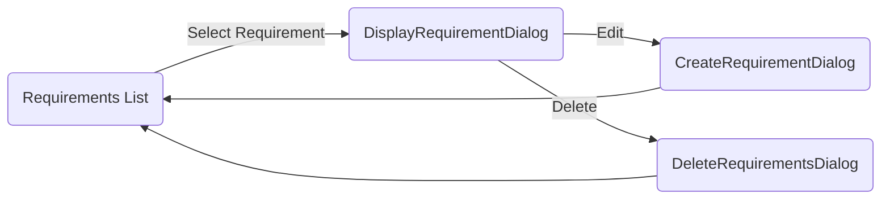

# FRET (Unofficial) Development Guide V0.2

#### Matt Luckcuck 2022


The Formal Requirements Elicitation Tool (FRET) is a desktop application written in the [Electron](https://www.electronjs.org/) framework, where the application's User Interface (UI) is written in HTML and CSS, and the back-end logic is written in Javascript. FRET uses the [React](https://reactjs.org/0) library for much of its UI, so a lot of the HTML and CSS is hidden away or buried in React library function calls.


## Application Entry Point

If you don't already have experience using the Electron framework, then reading through its [introduction](https://www.electronjs.org/docs/latest/) and [quick start](https://www.electronjs.org/docs/latest/tutorial/quick-start) guide is helpful when you're preparing to 'break in to' FRET. This should at least give a broad idea of how FRET works.

When you fun fret (`npm start` from inside the `fret-electron` directory, usually) eventually triggers the execution of `fret-electon/main.prod.js`. The `main.prod.js` file is itself built (using `webpack`) from `main.dev.js`, so changes that you want to make to the main file should be made to `main.dev.js` – I think `main.prod.js` is rebuilt/repacked each time you run FRET.

Below is the step-by-step description of the applications' start up:

1. Running FRET (`npm start`) triggers the `start` script in `package.json`, which reads `"start": "cross-env NODE_ENV=production electron ./app/"`
2. The `start` script runs the `main` file in `./app/package.json`. which is `fret-electron/main.prod.js` (which is built from `fret-election/main.dev.js`)
3. `main.dev.js`, line 176, shows where the main window's html file is loaded `mainWindow.loadURL(`file://${__dirname}/app.html`);` i.e. `fret-electron/app.html`
4. Somehow, `fret-election/app/containers/HomePage.js` is dropped into `fret-electron/app.html`
5. `HomePage.js` imports `fret-election/app/components/Home.js`
6. `Home.js` imports `fret-election/app/components/MainView.js` which sets up the main FRET window and is the main starting point for adding to FRET.

## Directory Structure

Inside the FRET repository, you'll find the following directory structure. (Note, this is not a complete list.)

* `executables`

* `fret-election` – Root directory for the electron application

  * `analysis`
  * `app` – Contains most of the FRET application
    * `actions`
    * `components` – Contains the various React components that make up the GUI/functionality
    * `containers`
    * `parser`
    * `reducers`
    * `store`
    * `utils`
  * `docs`
  * `flow-typed`
  * `internals`
  * `resources`
  * `support`
  * `templates`
  * `test`

* `tools` – Contains external tools or functionality that has been included in FRET

* `tutorialExamples` – Contains example FRET project(s)


## Version Dialogue Example

As a small example of adding functionality to FRET, I'm going to explain how I added a new "Version" button to the main menu. This functionality consists of a new button, a dialogue box, and printing a variable.

### Adding the Button

To add a new button to main menu, I used the Help button as an example. Copying the `div` defining the Help button, and updating the label, is an easy step. When running FRET, the new button appears. But the `onClick` behaviour is the same as for Help, so I updated this to instead call `this.openVersionDialog()`. I added the `<InfoIcon />`, which is imported on line 66.

Lines 661–670 show the `<div>` defining the button.

```xml
<div>
 <ListItem button onClick={() => this.openVersionDialog()}>
 	<ListItemIcon>
        <InfoIcon />
 	</ListItemIcon>
 	<ListItemText primary="Version" />
 </ListItem>
</div>
```

The next step is to define the `this.openVersionDialog()` method, to trigger the dialogue box.


### Triggering the Dialogue Box

To trigger the dialogue box to open, I used the Export button as an example. When the Export button is pressed, it calls a function that changes the `MainView`'s state. When the dialogue is closed, another function is called to update the state again.  I copied the functions, updating them to use appropriate names for the functions and the state variable.

Lines 470–482 contain the new functions, triggered when the button is pressed and when the dialogue box is closed, respectively.

```javascript
openVersionDialog = () => {
    this.setState({
      versionDialogOpen: true,
      anchorEl: null
    })
  }

  closeVersionDialog = () => {
    this.setState({
      versionDialogOpen: false,
      anchorEl: null
    })
  }
```

I then added `versionDialogOpen` into the state of the `MainView` class (line 216).

```javascript
class MainView extends React.Component {
  state = {
...
    versionDialogOpen: false,
```

I then needed to add to the `render()` method's return data, in the `MainView` class (starting on line 520). Again, I copied the entry for the Export dialogue, updating the information where needed. The following snippet, from lines 704–708, shows this addition.

``` xml
<VersionDialog
  open={this.state.versionDialogOpen}
  version={this.state.fretVersion}
  handleDialogClose={this.closeVersionDialog}
/>
```

It seems that because I have passed `VersionDialog` back to the rederer, that it now expects `VersionDialog` to be defined.

### Defining the Dialogue

Create new file `fret-electon/app/components/VersionDialog.js`, which was actually just a copy of `ExportRequirementsDialog.js`. Then, add an import to the top of `MainView.js`: `import VersionDialog from './VersionDialog';` (line 83)

In `VersionDialog.js`, where  `ExportRequirementsDialog` was used (the class name, the `export` line at the end of the file, and the property types definition just before the `export` line) need to be changed to `VersionDialog`.

The `handleDialogClose` property is the `closeVersionDialog()` function passed through from `MainView.js` (on line 707). Line 87 adds it to the state of `VersionDialog`, and then `handleClose()` calls it on line 81 – triggered by the OK button being pressed.

Similarly, the version string is passed as a property on line 706 of `MainView.js` and displayed in the dialog on line 113. It didn't seem to be required to add it to the state, for some reason; but I added it anyway (line 88).


## Adding the Refactoring Dialogue

This section describes how I went about adding the Refactoring Dialogue to FRET, which is a more involved example than the Version Dialogue above.

In `fret-electon/app/components/` there are three diaglogues for the requirements: `DisplayRequirementDialog`,  `CreateRequirementDialog`, and `DeleteRequirementDialog`. Each of them are imported into `RequirementDialogs`, which switches between them, depending on which is selected.

* `DisplayRequirementDialog` is shown when the requirement is selected in the Requirements list. It summarises the details of the requirement, and shows the edit and delete buttons at the top.
* ` CreateRequirementDialog` is shown when the "CREATE" button is pressed, in which case it opens with the fields empty; and when the edit button on the `DisplayRequirementDialog` is pressed, in which case the feilds are filled with the details of the requirement that selected to open the `DisplayRequirementDialog`
* `DeleteRequirementDialog` is shown when the delete button is pressed on the `DisplayRequirementDialog`, and asks for confirmation before deleting the requirement that was selected to open the `DisplayRequirementDialog`



### Adding the Button

Again, the first thing to do was to add a button in the `DisplayRequirementDialog.js` file to open the new dialogue.

Inside the return of the `render()` method, I added the following to produce the button:

```xml
<IconButton onClick={this.handleRefactorRequirement} size="small" color="tertiary" aria-label="edit" >
	<Tooltip id="tooltip-icon-refactor" title="Refactor Requirement">
		<BuildIcon />
	</Tooltip>
</IconButton>
```

With the <BuildIcon /> having been imported at the top of the file. This produces a new button, with a spanner icon, at the top of the Display Requirement Dialogue. Of course, pressing the button does nothing more than close the dialogue, because `handleRefactorRequirement` has not been implemented yet.

### Triggering the Dialogue Box

// TODO


## Other Electron Tips

* To make an interface react to updates the user makes, use a state variable and an event handler that uses `this.setState({var:new_value});`
  * For example, some text needs to change in response to the user selecting an item in a drop-down list
  * The drop-down list should use an `onChange` event handler to update a variable in the state, using `this.setState({variable: "the text"});`
  * Then the `TextField` that will display the text in `variable` should have `value = {this.state.variable}`
  * When the `setState()` method alters the state, the `render()` method is called again, so the new text will be shown on the interface.
* One nice way of having one component that can present multiple versions of its interface is to use `if…else` or `switch()` statements in the `render()` method.
  * Use a variable (either a boolean or an enum – a `const` object mapping the enum constants to a useful string) to decide which state the interface should be in.
  * Use the appropriate control structure inside the `render()` method
  * Inside each conditional block, remember to put that state of the interface inside `return();`

## Data Dictionaries

### FRET DB

1.


   :(...)
   :(...)
   :(...)
   :(...)
   _rev:(...)

| Name         | Type    | Description                                                  |
| ------------ | ------- | ------------------------------------------------------------ |
| fulltext     | String  | The FRETISH requirement text.                                |
| parent_reqid | String? | ID of the parent requirement, if any.                        |
| project      | String  | Name of the project this requirement belongs to.             |
| rationale    | String  | The rationale, added by the user. (Note, comment seems to not be saved.) |
| reqid        | String  | The ID (name) of the requirement.                            |
| semantics    | Object  | The semantics information generated by FRET:  CoCoSpecCode:(...) component:(...) componentTextRange:(...) component_name:(...) condition:(...) conditionTextRange:(...) description:(...) diagram:(...) diagramVariables:(...) ft:(...) ftExpanded:(...) post_condition:(...) post_condition_SMV_ft:(...) post_condition_SMV_pt:(...) post_condition_coco:(...) post_condition_unexp_ft:(...) post_condition_unexp_pt:(...) pre_condition:(...) pt:(...) ptExpanded:(...) qualifier_word:(...) regular_condition:(...) regular_condition_SMV_ft:(...) regular_condition_SMV_pt:(...) regular_condition_coco:(...) regular_condition_unexp_ft:(...) regular_condition_unexp_pt:(...) response:(...) responseTextRange:(...) scope:(...) timing:(...) type:(...) variables:Array(3) |
| status       | String  | The status flag (if any) of this requirement.                |
| template     | Object  | Presumably the internal template for translating this requirement into Temporal Logic. Unsure of the structure. |
| _id          | String  | UUID that identifies the requirement.                        |
| _rev         | String  | CouchDB's revision id for this entry (probably best not to touch it) |


### Model DB

1. Contains information about the modelling of the requirements, things that relate to the variable 'mapping' and exporting the requirements into CoCoSim or CoPilot.

| Name              | Type    | Description                                                  |
| ----------------- | ------- | ------------------------------------------------------------ |
| assignment        | String  | Usure What This Is                                           |
| completed         | Boolean | I think this is true if the variable has been 'mapped'       |
| component_name    | String  | The component that the variable belongs to                   |
| copilotAssignment | String  | Usure What This Is                                           |
| dataType          | String  | The variable's type                                          |
| description       | String  | Presumably a description of the variable                     |
| idType            | String  | If the variable is "Input", "Output", etc on the mapping screen |
| modeRequirement   | String? | Usure What This Is                                           |
| modelComponent    | String  | Usure What This Is                                           |
| modeldoc          | Boolean | Usure What This Is                                           |
| modeldoc_id       | String  | Usure What This Is, related to above?                        |
| moduleName        | String  | Usure What This Is                                           |
| project           | String  | The project this variable belongs to                         |
| reqs              | Array   | Array of UUIDs (I think reqids) for the requirements that this variable is used in. |
| variable_name     | String  | The variable's name                                          |
| _id               | String  | Mangles `project` + `component_name` + `variable_name` (no spaces) |
| _rev              | String  | CouchDB's revision id for this entry (probably best not to touch it) |
