# Exporting to Analysis tools

For analysis, FRET allows users to export requirements in formats that can be digested by other analysis tools. We have connected FRET with [CoCoSim](./cocosim.md) and [Copilot](./copilot.md) through the FRET analysis portal. We are also working on connected FRET with the [R2U2](./r2u2.md) tool.

Below we present a step-by-step guide of the [FRET analysis portal](#fretanalysisportal).

Please click on the tool names to view brief summaries of the analysis tools: [CoCoSim](./cocosim.md) and [Copilot](./copilot.md) tools.

[Back to FRET home page](../userManual.md)

## FRET Analysis Portal
To generate analysis code, additional information must be provided about the variables and modes of the component. To do that a user must follow the steps:

**1. Enter the FRET Analysis portal**

Click the Analysis Portal icon in the red box in the left hand side panel.

***
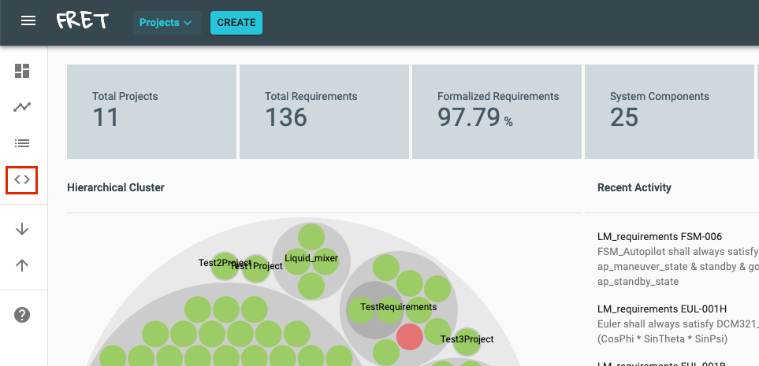  

***

**2. Choose a specific project**

The Analysis Portal will appear empty initially if no specific project is chosen. It will prompt you to pick a specific project by clicking on the Projects dropdown menu.

***
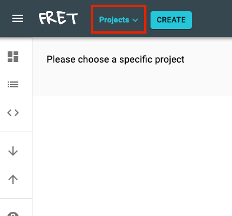

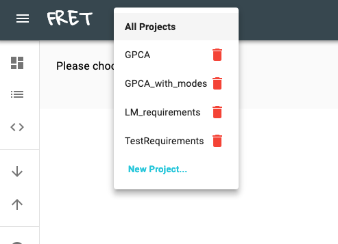

***

Once a specific project is chosen, the Analysis Portal will provide a summary of the variables used in the project's requirements organized per component.

FRET automatically extracts all components, variables, functions, and modes that have been specified in the requirements of a project. For each component it creates an accordion field that (if clicked) displays a table with the variables and the modes of that particular component.

***
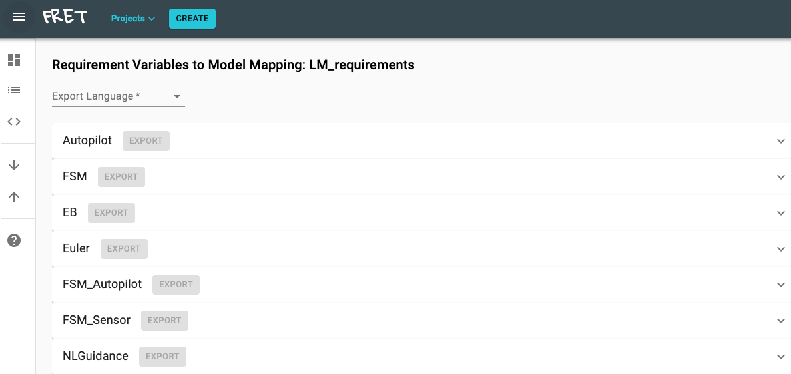

***  

**3. Choose export language**

Pick an export language for the generated specification/code. We currently offer two options: 1) CoCoSpec and 2) Copilot.

***

***  

**4. Complete necessary variable information**

Depending on the chosen export language, there are different requirements for generating the corresponding specification code. In particular, for generating CoCoSpec code all variable information must be added/mapped in comparison with Copilot that there is no such requirement.

***4a. Copilot code generation***

No variable information is required for Copilot. Optionally, the user can follow the steps described below to add information about the data type, variable type, etc of each variable.

***4b. CoCoSpec code generation***

To generate CoCoSpec code, for each variable, the following information must be entered by the user, i.e.,:
* data type (i.e., bool, int, real, enum, struct),
* type (i.e., input, output, internal, mode, function),
* internal variable assignments,
* mode require statements.

A user may optionally import information from a corresponding Simulink model and also make the mapping between the components/variables described in the requirements and the components/port types of the Simulink model. To do that, the user can optionally generate the model information in a compliant-to-FRET JSON format by using `fret_IR.m`. Then the JSON file can be imported into FRET by clicking the Import button.

***
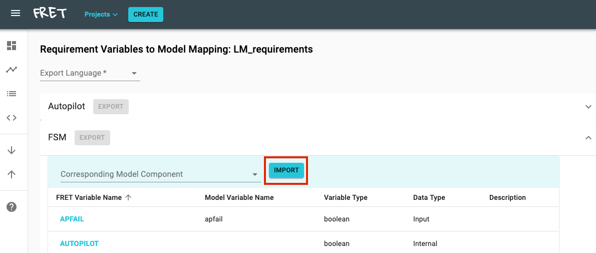  

***

If model information has been imported, the user may pick for each FRET component a corresponding model component from the dropdown menu of the variables table.

***
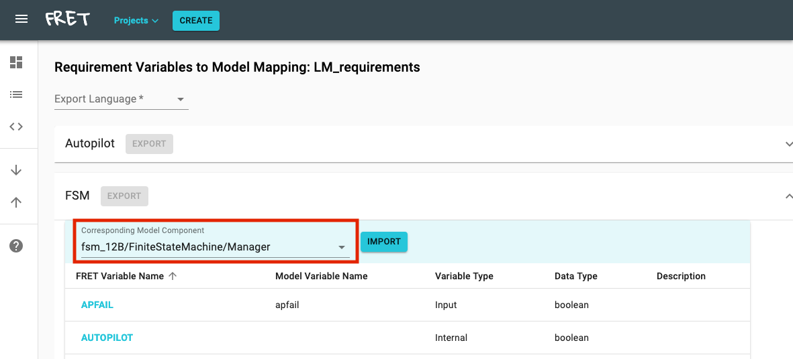  

***

Next, for each variable, all mandatory fields must be completed. For each type of variable, i.e., `Input`, `Output`, `Internal`, and `Mode`, there are different mandatory fields. Mandatory fields are depicted with an asterisk.

***
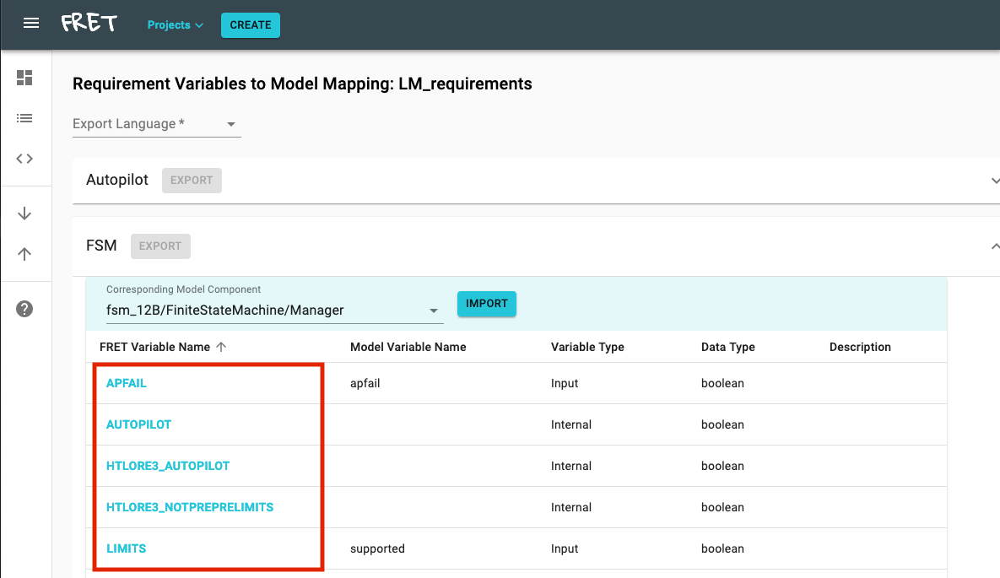  

***

To complete the information of a variable, please click on the corresponding FRET Variable name. Then the Update Variable information will pop up. To save the updated information please click on the `UPDATE` button.

***
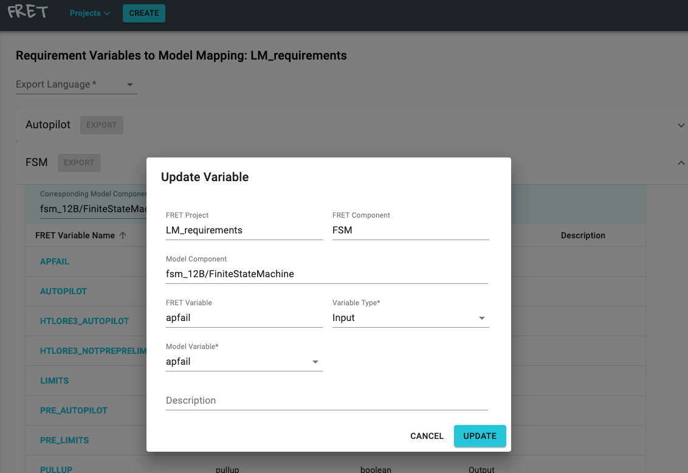

***

**5. Click on the Export button and save the generated code**

Once all mandatory fields have been completed for all the variables/modes of a component, then the export button becomes enabled for CoCoSpec code generation.

***
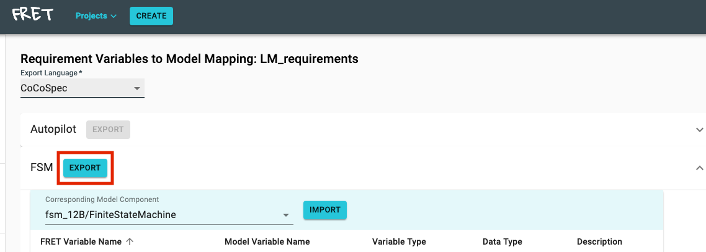  

***

Since there are no mandatory fields for Copilot, the export buttons are always enabled.

***
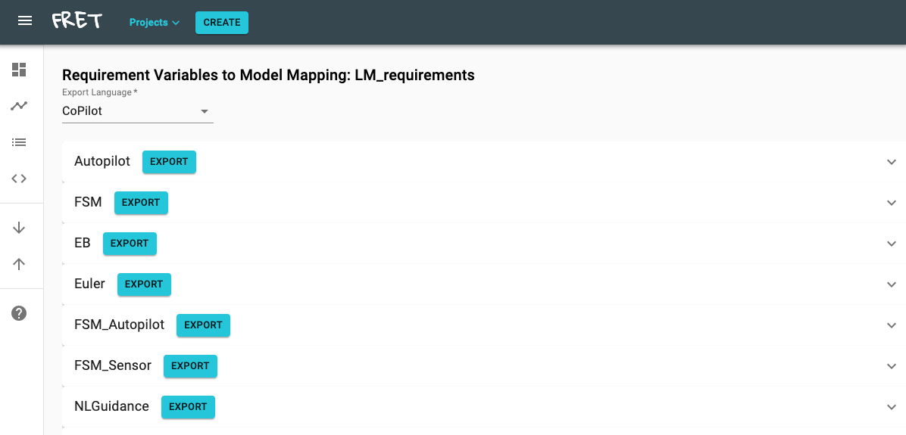  

***

Once the export button is clicked, the generated code can be saved in the form of a Lustre file along with model traceability data. The two files are compined in .zip format. The Lustre specification and the traceability data files can then be given as input to the CoCoSim tool.

***
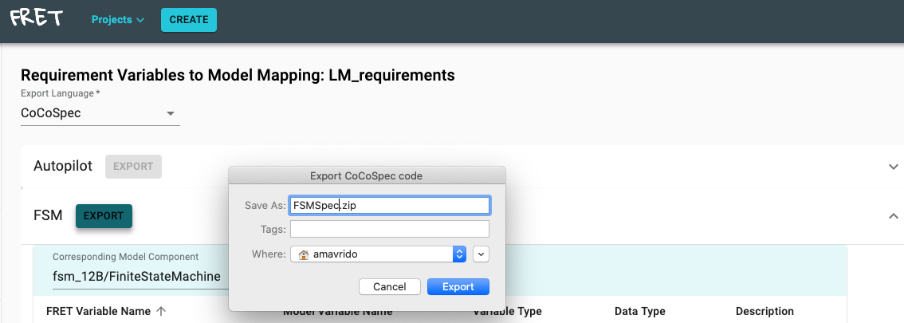  

***

[Back to FRET home page](../userManual.md)
