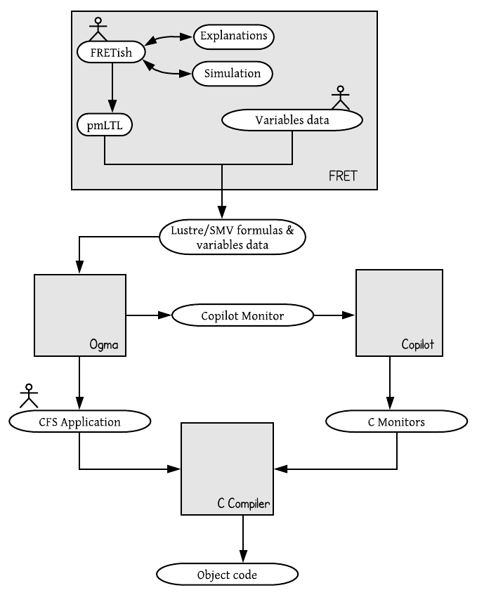

# Copilot

[Copilot](https://copilot-language.github.io/) is a high-level runtime verification framework that produces hard real time C code. Among others, Copilot has been used by the Safety Critical Avionics Systems Branch of NASA Langley Research Center to monitor drone test flights. Copilot can be used for developing CFS applications.

Through our FRET-To-Copilot integration, we allow users to write requirements using the intuitive language of FRET and automatically formalize them. The formalized requirements can then be exported along with information about variables and functions in a JSON format, which can be directly digested by Copilot through the Ogma tool.

## The FRET-Copilot integration workflow

The figure below shows the workflow of the FRET-Copilot integration.  Initially, requirements written in FRETish are translated by FRET into pure Past Time Metric Linear Temporal Logic (pmLTL) formulas. Variables data can be optionally provided by the user regarding the requirement variables (e.g., data types) and functions. The pmLTL formulas and the variables data are used to generate the input that is given to the Ogma tool in the form of a JSON file. This input consists of requirements formalizations in SMV and Lustre syntax, as well as information about variables and functions. The generated JSON file is then imported into Ogma tool. Ogma then creates a Copilot monitor based and provides it as input to the Copilot tool. Copilot then generates the C Monitor which can be provided with other C code to a C Compiler
for the generation of the final object code.

## Related papers

1. [From Requirements to Autonomous Flight: An Overview of the Monitoring ICAROUS Project](https://shemesh.larc.nasa.gov/people/cam/publications/FMAS2020_3.pdf)\
Aaron Dutle, Cesar A. Munoz, Esther Conrad, Alwyn Goodloe, Laura Titolo, Ivan Perez, Swee Balachandran, Dimitra Giannakopoulou, Anastasia Mavridou, Thomas Pressburger\
2nd Workshop on Formal Methods for Autonomous Systems (FMAS), June 2020.

***

[Back to Analysis Portal page](./analysis.md)

[Back to FRET home page](../userManual.md)
