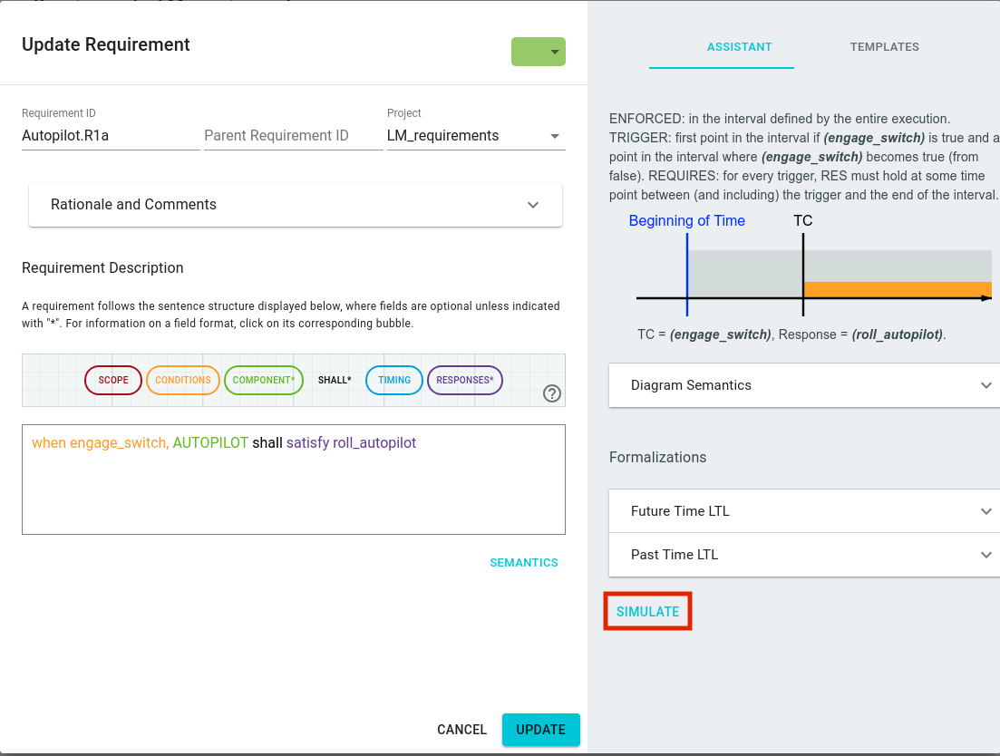
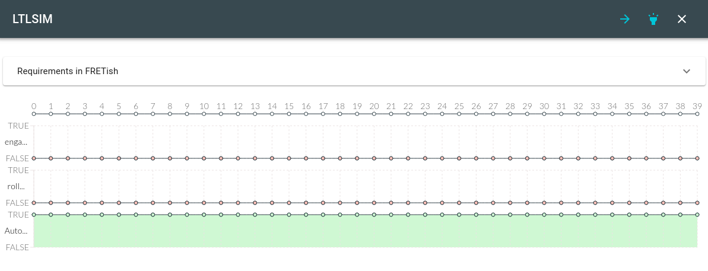
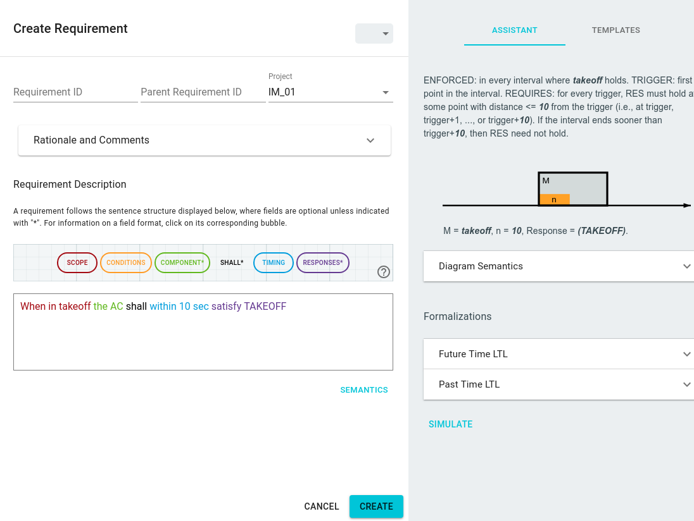
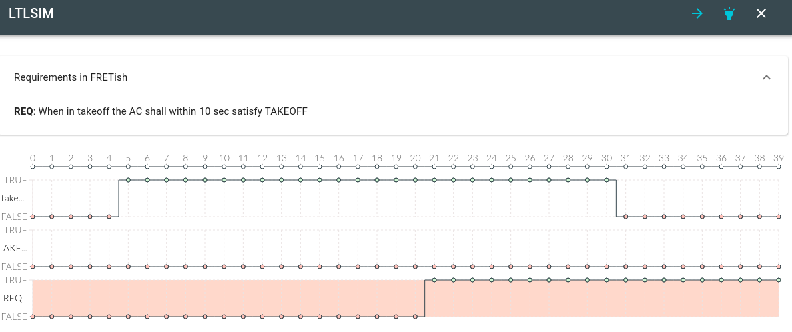
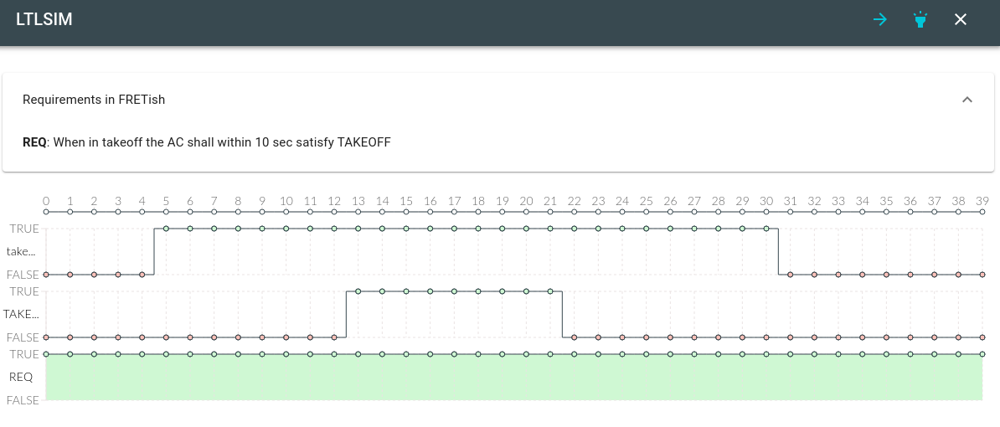
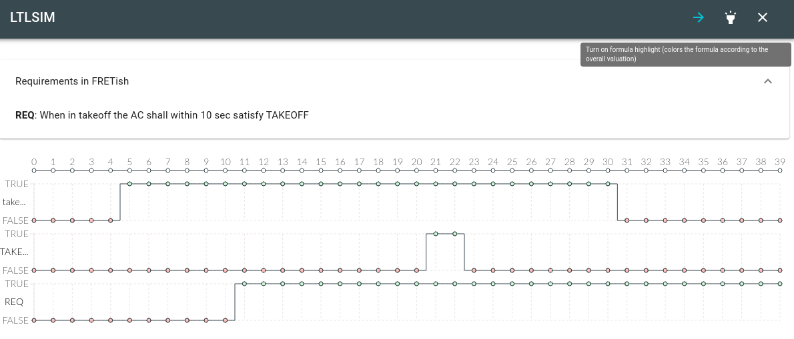
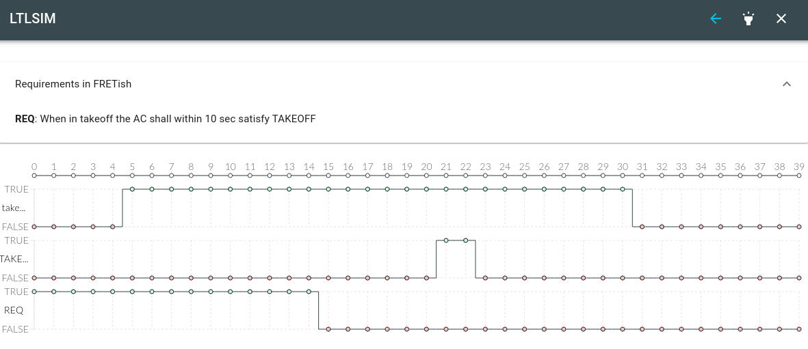
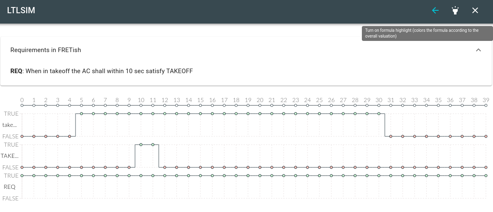

<!-- ltlsim.md -->

# Visualizing Requirements

The temporal structure of a requirement can be rather complicated
and hard to understand.
In this respect, FRET supports the user twofold:
* in the requirements editor window, the assistant shows a principled
graphical representation of the current requirement including
important time points.
* the LTL simulator (LTLSIM) is an interactive tool for setting up temporal
traces and to study the valuation of a requirement. LTLSIM will be
described in this section.

## Starting LTLSIM
The LTLSIM tool is started from the requirements editor using the
`SIMULATE` button on the lower right of the window.
Note that
* the SIMULATE button is only active after the `SEMANTICS` button has
generated the temporal logic formulas for the requirement, and
* the LTLSIM simulator and its underlying tool nuXMV is [installed properly](./installingFRET/installationInstructions.md).

***

***

## The LTLSIM Window
The LTLSIM simulator has four major elements:
* the control buttons in header of the window,
* the requirements field,
* the variable traces, and
* the output trace.
***

***

The variable and output traces depict temporal traces of variables of the requirement, and a valuation of the formula, respectively.
A trace length of 40 time steps is set by default.

The variable traces can be modified interactively. Moving over a signal
trace and clicking on the small circle toggles the value of that variable
for that time between true and false.
Dragging a signal edge (that is, moving the mouse between the true/false
edge and moving it while clicked) enables the user to select larger
portions of the time trace.

Variable names and values (true, false) are shown to the left of the trace.
In many cases, variable names are abbreviated. Hovering over them shows
the full name.

Whenever the traces of the input values change, the bottom trace, showing
the valuation of the formula, is freshly evaluated, reflecting all
changes of the input. For large and complex formulas that might take
a few moments. With default settings, the output trace is colored according to the overall valuation of the formula. (red=false, green=true).

The ID and the requirement text can be shown by clicking the
down-arrow at the top of the inner window, labeled "Requirements in FRETish".
The translated future time or past time formula is visible, when hovering over the name of the requirement to the left of the bottom trace.

## LTLSIM control
The LTLSIM tool is, by default, visualizing the future time formalization
of the requirement. This is indicated by the blue, right-pointing arrow
on the top of the LTLSIM window.
Clicking it switches the representation to past time.
Note that input traces that are interactively modified are not changed.

The small "torch" symbol turns on (default) and off the coloring of the
output trace according to its overall valuation.

The `X` closes the LTLSIM tool and leads back to the requirements editor.

## Restrictions

Because LTLSIM is using the external tool nuXMV for formula valuation, there currently exist a number of syntactic restrictions:
* For conditions and response, only Boolean predicates are allowed, but no arithmetic expressions. E.g.,  `alt > 5` cannot be used with LTLSIM.
* LTLSIM will not work if any of the following uppercase atomic
propositions are used as Boolean formulas:
`A E F G H O S T U V X Y Z AF AG AX BU EF EG EX ABF ABG EBF EBG MAX MIN LAST`

## Example

As an example, we use the requirement:
`When in takeoff, the AC shall within 10 seconds satisfy TAKEOFF`.
***

***

The Requirements Editor shows the temporal diagrams and can display the
future-time or past-time formulas.

After opening the LTLSIM with `SIMULATE`, we first set the
mode `takeoff` to be true between time steps 5 and 30.
The requirement is violated in this case, because no `TAKEOFF` signal
is present during this mode.
***

***

We now set the response `TAKEOFF` to start at time point 13. This
makes the formula true.
***

***

If, on the other hand, the response signal comes too late, the
requirement is not fulfilled. Here, the `TAKEOFF` signal only starts
at t=21s. In this screen shot, we also turned off the overall
formula valuation, reported as coloring of the bottom trace.
***

***

The next two diagrams show the LTLSIM for past time logic. Changing between
the two logics is accomplished by clicking the small blue arrow on the top right
of the LTLSIM window.

***

***

Here the response is coming in time.

***

***

[Back to FRET home page](../userManual.md)
