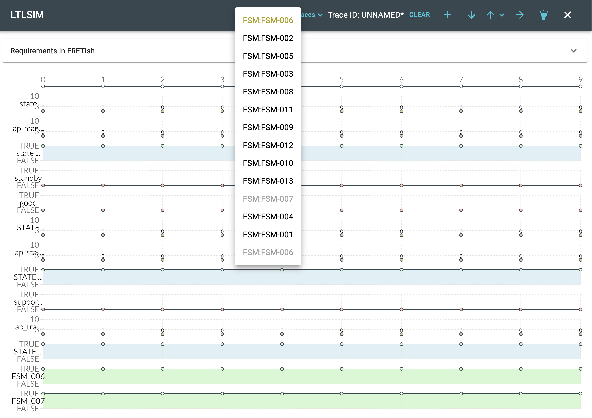
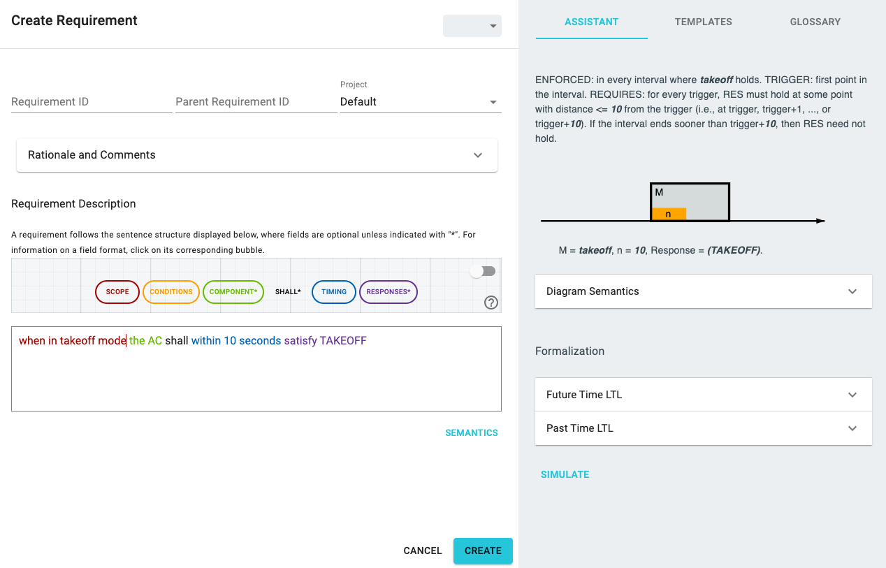

<!-- ltlsim.md -->

# Visualizing Requirements

The temporal structure of one or more requirements and their temporal interactions can be rather complicated
and hard to understand.
In this respect, FRET supports the user twofold:

* in the requirements editor window, the assistant shows a principled
graphical representation of the current requirement including
important time points.
* the LTL simulator (LTLSIM) is an interactive tool for setting up temporal
traces and to study the valuation of one or more requirements.


The LTLSIM tool, described below, is used for visualization of the temporal
behavior of

* one or more requirements on temporal traces which can be changed interactively, and
* a set of requirements showing up in a conflict group during
Realizability Analysis. Here LTLSIM is started with a counter-example trace
shown automatically.


In the following, we describe the common functionality of LTLSIM for both
use cases, and mention specifics as we go.

## Starting LTLSIM
### Starting LTLSIM from the Requirements Editor
The LTLSIM tool is started from the requirements editor using the
`SIMULATE` button on the lower right of the window.
Note that

* the SIMULATE button is only active after the `SEMANTICS` button has
generated the temporal logic formulas for the requirement, and
* the LTLSIM simulator and its underlying tool NuSMV has been [installed properly](../installingFRET/installationInstructions.md).


### Starting LTLSIM from the Realizability Checking Portal
LTLSIM can be used after a realizability checking analysis has been carried out and one or more conflicts have been found. Please read ["Realizability checking"](../exports/realizabilityManual.md) for details.


## The LTLSIM Window
The LTLSIM simulator has four major elements:

* the control buttons and menues in dark header bar of the window,
* the requirements field,
* the variable traces, and
* the output trace(s).

We first show, how traces can be understood and changed, then we go into details on how to control LTLSIM.

***


***

### How to read and change the variable traces 
The variable and output traces depict temporal traces of variables of the requirement, and a valuation of the formula, respectively.
A trace length of 10 time steps is set by default, but can be modified by the user.

Variable traces can be modified interactively. Moving over a signal trace for a Boolean variable and clicking on the small circle toggles the value of that variable for that time between true and false.
Dragging a signal edge (that is, moving the mouse between the true/false edge and moving it while clicked) enables the user to select larger
portions of the time trace.

Variable names and values (`TRUE`, `FALSE`) are shown to the left of the trace. In many cases, variable names are abbreviated. Hovering over them shows their full name.

Variables with numeric values are shown in a similar way. If a formula contains arithmetic expressions, e.g., `pressure > 5`, LTLSIM shows
the original (numeric) variable `pressure` as well as the valuation of the expression (as a Boolean). Traces for dependent terms are colored in
light-blue and cannot be changed by the user. Rather, changes in the value of the original variable(s), here `pressure` automatically updates the value of the arithmetic expression for that time point.
The reason for this is that the NuSMV checker has no built-in support for arithmetic expressions.

Traces of variables with numeric values can be changed interactively in a similar way as Boolean variables. To the left of the trace, the minimal and maximal values for that variable are shown. One click on the small circle inside the trace increments the variable value at the selected time by 1/10th of the variable range. If the maximum value is reached, a subsequent click resets the value to the minimum.

The bottom line(s) show the valuation of each requirement at this specific time.
Whenever any of the input values change, the bottom trace(s), showing
the valuation of the formula(s), are freshly evaluated, reflecting all
changes of the input. For large and complex formulas that might take
a few moments. During that time, the cursor is set to a waiting symbol (hour-glass or spinning circle). During that time, no interactions with the Visualizer should be attempted. 

With default settings, the output trace is colored according to the overall valuation of the formula. (red=false, green=true).

### Active requirements
The current trace can be valuated according to multiple requirements. When LTLSIM is started out of the requirements editor, that requirement is shown automatically.

Clicking on `Requirements in FRETish` will show the full FRETish text of each requirement together with its ID. This avoids frequent change between editor and simulator view. A second click on that title hides the details again.

***


***

## LTLSIM control
The LTLSIM tool supports a number of control options and commands that can be issued interactively. Most of these options are accessible through the dark header line of the LTLSIM window.


### Requirements
This menu `Requirements` allows the user to add (or remove) additional requirements from the current project to be included into the analysis. Clicking opens a selection
menu of possible requirements. Requirement names that are shown in gray are already selected; clicking on those hides that requirement from the visualization.
The first line shows the requirement name, from which LTLSIM was called. This requirement cannot be hidden.
Note that currently ony one requirement can be added or hidden at a single time.

For each requirement selected a valuation trace is added at the end of the trace window.

***


***

### Traces
From the `Traces` menu, a trace can be selected from existing and loaded traces can be selected.
The visualizer shows the selected traces and valuates it.

Note that the values of the previous trace are
lost unless that trace has been updated or exported.
If the TraceID shown in the header line is adorned with an asterisk `*`, that trace has *not* been updated and
informationmight be lost

### Trace ID
This field shows the ID (or short name) of the current trace

* When LTLSIM is started from the editor, an empty trace with the ID `UNNAMED` is generated and its status is set to not updated
* When one or more variables of the current trace are manually modified, the status of the current trace is set to not-updated. The trace ID is adorned by a `*`.

### CLEAR

A new trace with zero-values is generated when selecting the `CLEAR` button. The values of the previous trace are lost if it is not updated (an asterisk is shown at the name). A new trace ID will be generated of the form `T-###` where `###` is a number.

### Annotating and Updating Traces
When clicking on the `+` button, a dialog pops up, which allows the user to enter or update:

* Trace ID - short name which will be displayed at the top and in the menues. This trace ID should not contain newlines
* Trace Description - optional text for describing the trace
* Link trace to requirement(s) - annotate, to which requirement(s) this trace belongs. Available requirements (from the current project) are available in the pull-down menu `Link to`. By default the trace always belongs to its principle requirements (the one, for which the visualizer has been opened). A trace can belong to one or multiple requirements.
* `CANCEL` - cancel the all changes and return
* `UPDATE` - save or update this information to the current trace. Only then, the current trace is considered to be updated, is shown in the `Traces` menu and is available for export. After click, the `*` next to the Trace ID in the header line vanishes.

Notes:

* if the Trace ID is not changed, the trace information will be updated
* If the trace-ID is changed, then the current trace will be stored under this name. This works somewhat similar to Save-As and can be used to produce a copy of a trace.
* This popup window creates or updates traces but does *not* save the trace to a file.


***


***

### Importing Traces
Clicking on the &darr; button opens a file selection dialog to import a trace in CSV or JSON format.
A CVS file can only contain one trace and has limited meta-information; JSON files can read in and filter multiple traces.
The file formats are described below.

A trace from a CSV file is loaded and shown as the currently active trace with a newly generated Trace ID and a description stating that this trace has been imported. This trace is only linked to the calling requirement.

A JSON file can contain one or more traces. By default, all traces from that file will be loaded if their linked-requirements entry matches with one of the selectable requirements of the current LTLSIM.


If the current list of traces already contains the requirement ID of a requirement to be loaded, the
loaded requirement overwrites the one in memory.


### Exporting Traces
Clicking of the Up-arrow button &uparr; a menu is opened with the export options:

* export the current trace in JSON format
* export the current trace in CSV format
* export all traces in JSON format

Note that only the current trace can be exported in CSV format.

Each of the selections open afile selection box. A warning is issued if an existing file is to be overwritten.

The file formats are described below.


### Selection of Logic
When LTLSIM is invoked from the requirements editor, by default, the future-time representation of the formula is used, as indicated by the forward arrow (&rarr;) button. In contrast, the LTLSIM opened from the realizability portal, shows the
past-time formulas instead-shown as a backwards arrow (&larr;).

By clicking on the Arrow button, the user can toogle between future time and past time analysis.

Notes:

* Switching the logic does not affect the trace, so it does not need to be updated.

* depending on the formula and the application, switching of the logics can
have unwanted effects.

### Overall Evaluation
Clicking the "torch" button toggles the overall evaluation feature of the formula.
If activated, the trace(s) for the requirement(s) are high-lighted in green (overall valuation is true) or red (overall valuation is false).

### Setting the Trace Length
This feature is controlled by a clock on the time line (top line) of the trace display.
Clicking on the top line opens a dialog window
where the trace length can be changed.
A number can be given and, after hitting `APPLY` the current trace (only) is adjusted according and a new valuation is calculated.

Notes:

* Trace lengths should be set to a value between 4 and 40. Longer traces can substantially increase visualization time, since the nuXvm tool must check validity of each formula for each time point.
* A change in the trace length sets the trace to modified (showin the `*` at the name). If updated with `+`, the new trace length is locked in with that trace.
This means data of a longer trace are lost when shortening. These changes can be undone (before updating) by setting the trace-length to the original value.
* The trace length is a property for each trace and is stored/exported with it. When importing traces, they are shown with their original lengths.

***


***

### Closing the LTLSIM
Clicking the `X` on the top right closes the LTLSIM and returns to the previous window. 

Notes:

* if the LTLSIM is opened from the editor window again by `SIMULATE`, all data and traces are retained unless the requirement has changed and `SEMANTICS` is pressed again.
* Leaving the associated Requirements editor removes all selections and traces that have not been exported.


## File format for Traces
### CSV Format

The CSV format only saves the basic values of the trace. Trace ID and other information is not stored.
In this format, the first line contains the variable names, subsequent lines the values. Dependent variables, corresponding to arithmetic expressions, are preceded by a `*`, as shown in the following example.
The variable `*xxx_S__lt__S_2_S_` corresponds to the Boolean result of `xxx < 2`

```
LAST,xxx,*xxx_S__lt__S_2_S_
0,0,true
0,1,true
0,0,true
0,2,false
0,0,true
1,0,true
```

Notes:

* The `LAST` variable is added automatically to all future-time formulas. 
* CSV traces for import do not need to contain dependent variables or the LAST - those will be added automatically upon import.


### JSON Format
The JSON format stores all relevabt information about one or multiple traces

* The file is a list of JSON objects, containing
* Trace ID
* Trace Description
* Trace Length
* Project name
* List of "linked" requirement IDs
* For each of the variables in the trace, Name, type (`category` or `number`), minimal, and maximal values are given. The entry `canChange` indicates if the variable is dependent (`canChange=False`) or a regular changeable variable.
* The values of a trace with V variables and N time steps is saved as a linearized vector `(VxN)(:)`
* For importing, only Trace ID, Project Name, Variable Names, and the values must be provided. Other information is inferred during import.

## Visualization
When visualizing the future-time formalization, the bottom trace shows, at
each timepoint, the evaluation of the formula on the trace starting at that
timepoint and extending to the end of the trace. For example, with a
tracelength of 40, the formula is evaluated forwards starting from timepoint
0 to the end of the trace (timepoint 39), from timepoint 1 to the end of the
trace, etc. The overall color is the evaluation at timepoint 0. When
visualizing the past-time formalization, the bottom trace shows, at each
timepoint, the evaluation of the trace starting at timepoint 0 and extending
to the timepoint. For example, the formula is evaluated at timepoint 39 for
the trace from timepoint 0 to timepoint 39, at timepoint 38 for the trace
from timepoint 0 to timepoint 38, etc. The overall color is the evaluation
at timepoint 39.


## Restrictions

Because LTLSIM is using the external tool NuSMV for formula valuation, there currently exist a number of syntactic restrictions:
* LTLSIM will not work if any of the following uppercase atomic
propositions are used as Boolean formulas:
`A E F G H O S T U V X Y Z AF AG AX BU EF EG EX ABF ABG EBF EBG MAX MIN LAST`

## Example

As an example, we use the requirement:
`When in takeoff mode, the AC shall within 10 seconds satisfy TAKEOFF`.
***


***

The Requirements Editor shows the temporal diagrams and can display the
future-time or past-time formulas.

After opening the LTLSIM with `SIMULATE`, we first set the
mode `takeoff` to be true between time steps 5 and 30.
The requirement is violated in this case, because no `TAKEOFF` signal
is present during this mode.
***


***

We now set the response `TAKEOFF` to start at time point 13. This
makes the formula true.
***


***

If, on the other hand, the response signal comes too late, the
requirement is not fulfilled. Here, the `TAKEOFF` signal only starts
at t=21s. In this screen shot, we also turned off the overall
formula valuation, reported as coloring of the bottom trace.
***


***

The next two diagrams show the LTLSIM for past time logic. Changing between
the two logics is accomplished by clicking the small blue arrow on the top right
of the LTLSIM window.

***


***

Here the response is coming in time.

***


***

[Back to FRET home page](../userManual.md)
