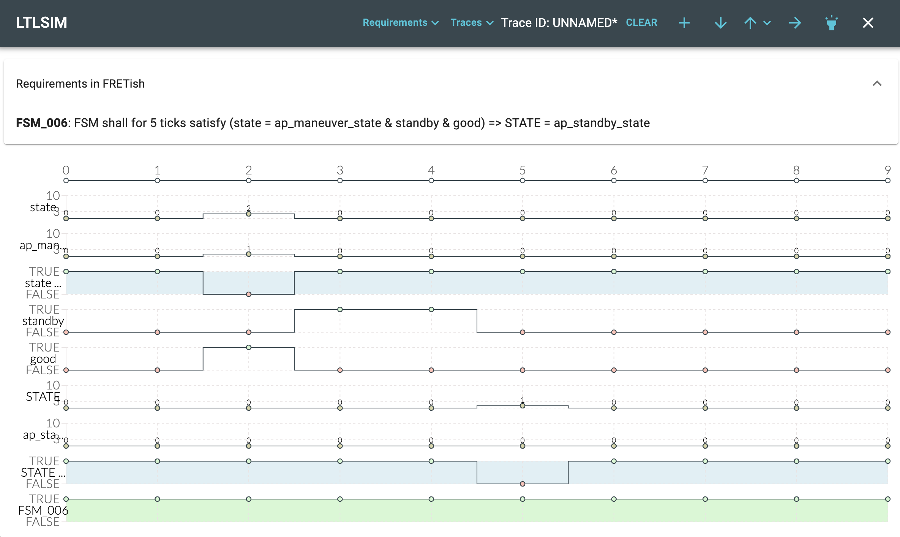
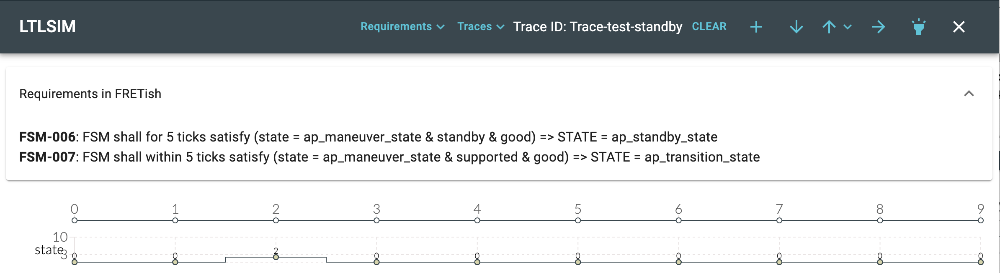
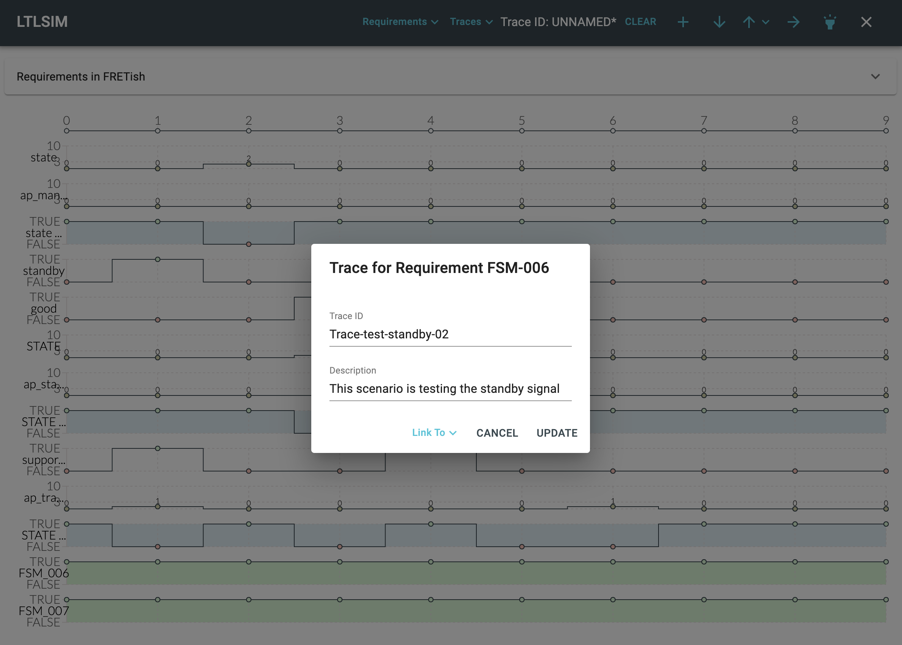
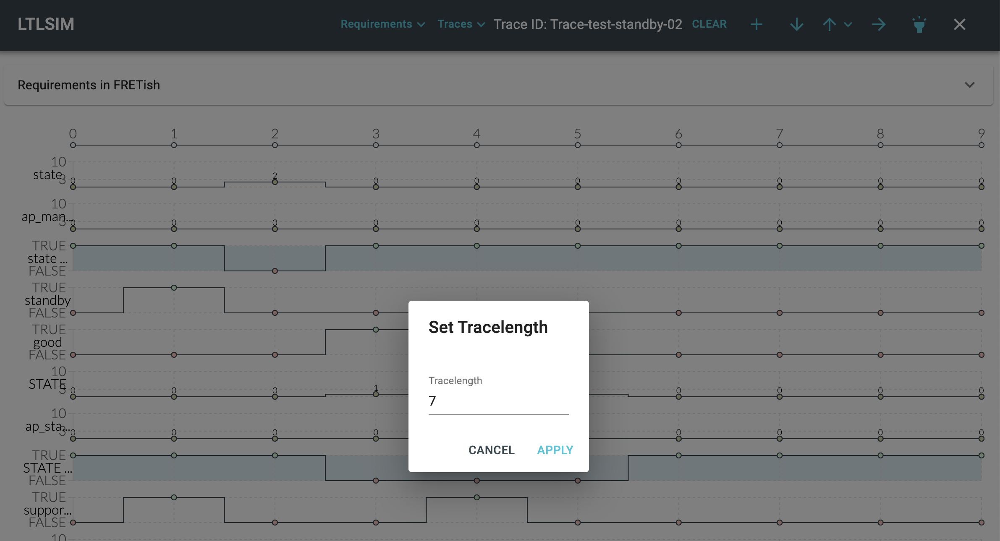

<!-- ltlsim.md -->

# Visualizing Requirements

The temporal structure of a requirement can be rather complicated
and hard to understand.
In this respect, FRET supports the user twofold:
* in the requirements editor window, the assistant shows a principled
graphical representation of the current requirement including
important time points.
* the LTL simulator (LTLSIM) is an interactive tool for setting up temporal
traces and to study the valuation of one or more requirements.


The LTLSIM tool, described below, is used for visualization of the temporal
behavior of 
* one or more requirements during editing/viewing, and
* a set of requirements showing up in a conflict group during
Realizability Analysis. Here LTLSIM is started with a counter-example trace
shown automatically.

In the following, we describe the common functionality of LTLSIM for both
use cases, and mention specifics as we go.

## Starting LTLSIM
### Starting LTLSIM from the Requirements Editor
The LTLSIM tool is started from the requirements editor using the
`SIMULATE` button on the lower right of the window.
Note that
* the SIMULATE button is only active after the `SEMANTICS` button has
generated the temporal logic formulas for the requirement, and
* the LTLSIM simulator and its underlying tool NuSMV is [installed properly](../installingFRET/installationInstructions.md).


### Starting LTLSIM from the Realizability Checking Portal
LTLSIM can be used after a realizability checking analysis has been carried out and one or more conflicts have been found. Please read ["Realizability checking"](../exports/realizabilityManual.md) for details.


## The LTLSIM Window
The LTLSIM simulator has four major elements:
* the control buttons and menues in header of the window,
* the requirements field,
* the variable traces, and
* the output trace(s).

***


***

The variable and output traces depict temporal traces of variables of the requirement, and a valuation of the formula, respectively.
A trace length of 10 time steps is set by default, but can be modified by the
user.

The variable traces can be modified interactively. Moving over a signal
trace and clicking on the small circle toggles the value of that variable
for that time between true and false.
Dragging a signal edge (that is, moving the mouse between the true/false
edge and moving it while clicked) enables the user to select larger
portions of the time trace.

Variable names and values (true, false) are shown to the left of the trace.
In many cases, variable names are abbreviated. Hovering over them shows
the full name.

If a formula contains arithmetic expressions, e.g., `pressure > 5`, LTLSIM shows
the original (numeric) variable `pressure` as well as the evaluation of the
expression (as a Boolean term). Traces for dependent terms are colored in
light-blue and cannot be changed by the user directly. Rather, changes in the
value of the original variable(s), here `pressure` automatically updates the value of the arithmetic expression for that time points.
The reason for this is that the NuSMV checker cannot handle arithmetic expressions natively.

Traces of variables with numeric values can be changed interactively in a similar way as Boolean values. However, one click increments the variable value at the selected time by 1/10th of the variable range, usually by 1. If the maximum value is reached, a subsequent click resets the value to the minimum.

Whenever the traces of the input values change, the bottom trace(s), showing
the valuation of the formula(s), is freshly evaluated, reflecting all
changes of the input. For large and complex formulas that might take
a few moments. With default settings, the output trace is colored according to the overall valuation of the formula. (red=false, green=true).

The ID and the requirement text of the requirement(s) can be shown by clicking the
down-arrow at the top of the inner window, labeled "Requirements in FRETish".


## LTLSIM control
The LTLSIM tool supports a number of control options and commands that
can be issued interactively. Most of these options are shown in the
header line of the LTLSIM window

***


***

### Requirements
This menu `Req` allows the user to add (or remove) additional requirements from
the current project to be included into the analysis. Clicking opens a selection
menu of possible requirements. Requirement names that are shown in gray are already selected; clicking on those hides that requirement from the visualization.
The first line shows the requirement name, from which LTLSIM was called. This
requirement cannot be hidden

### Listing of Requirements
The current list of requirements in the visualizer, including the full text in FRETish, can be toggled by clicking on `Requirements in FRETish` just below the header.

***


***

### Traces
From this menu, a new (empty) trace can be created. The current trace values are
lost unless that trace has been saved or exported.
The current trace can be saved into a json file. 

### Annotating Traces
When clicking on the `+` button, a dialog pops up, which allows the user
to provide a name and description for the current trace.

***


***

### Importing Traces
Clicking on the DownArrow opens a file selection dialog to import a trace
in CSV or JSON format.

In the CVS format, the first line contains the variable names, subsequent
lines the values. Dependent variables, corresponding to arithmetic expressions, must be preceded by a `*`, as shown in the following example. The trace export automatically performs this operation during saving the trace.

```
LAST,xxx,*xxx_S__lt__S_2_S_
0,0,true
0,1,true
0,0,true
0,2,false
0,0,true
1,0,true
```

Note that the `LAST` variable is added automatically for future-time formulas.
However that variable is not displayed.


### Exporting Traces
The current trace can be exported into a CSV or JSON file. Upon clicking the
uparrow-button, a file selection dialog opens and the current trace will be
written into that file.

### Selection of Logic
When LTLSIM is invoked from the requirements editor, the future-time
representation of the formula are used, indicated by the forward arrow.
In contrast, the LTLSIM opened from the realizability portal, shows the
past-time formulas instead (shown as an backwards arrow).

By clicking on that error, the user can switch between future time and past
time analysis.

Caution:
* depending on the formula and the application, switching of the logics can
have unwanted effects.

### Overall Evaluation
Clicking the "torch" symbol toggles the overall evaluation of the formula.
If activated, the trace(s) for the requirement(s) are high-lighted in
green or red

### Setting the Trace Length
Clicking on the top chart of LTLSIM (the time line) opens a dialog window
where the trace length can be changed.
Note that longer traces can substantially increase visualization time, since 
the nuXvm tool must check validity of each formula for each time point

***


***

### Closing the LTLSIM
Clicking the `X` on the top right closes the LTLSIM and returns to the
previous window. Note that opening LTLSIM from the same window immediately again
retains and displays the previous trace.


## Visualization
When visualizing the future-time formalization, the bottom trace shows, at
each timepoint, the evaluation of the formula on the trace starting at that
timepoint and extending to the end of the trace. For example, with a
tracelength of 40, the formula is evaluated forwards starting from timepoint
0 to the end of the trace (timepoint 39), from timepoint 1 to the end of the
trace, etc. The overall color is the evaluation at timepoint 0. When
visualizing the past-time formalization, the bottom trace shows, at each
timepoint, the evaluation of the trace starting at timepoint 0 and extending
to the timepoint. For example, the formula is evaluated at timepoint 39 for
the trace from timepoint 0 to timepoint 39, at timepoint 38 for the trace
from timepoint 0 to timepoint 38, etc. The overall color is the evaluation
at timepoint 39.


The `X` closes the LTLSIM tool and leads back to the requirements editor.

## Restrictions

Because LTLSIM is using the external tool NuSMV for formula valuation, there currently exist a number of syntactic restrictions:
* LTLSIM will not work if any of the following uppercase atomic
propositions are used as Boolean formulas:
`A E F G H O S T U V X Y Z AF AG AX BU EF EG EX ABF ABG EBF EBG MAX MIN LAST`

## Example

As an example, we use the requirement:
`When in takeoff, the AC shall within 10 seconds satisfy TAKEOFF`.
***


***

The Requirements Editor shows the temporal diagrams and can display the
future-time or past-time formulas.

After opening the LTLSIM with `SIMULATE`, we first set the
mode `takeoff` to be true between time steps 5 and 30.
The requirement is violated in this case, because no `TAKEOFF` signal
is present during this mode.
***


***

We now set the response `TAKEOFF` to start at time point 13. This
makes the formula true.
***


***

If, on the other hand, the response signal comes too late, the
requirement is not fulfilled. Here, the `TAKEOFF` signal only starts
at t=21s. In this screen shot, we also turned off the overall
formula valuation, reported as coloring of the bottom trace.
***


***

The next two diagrams show the LTLSIM for past time logic. Changing between
the two logics is accomplished by clicking the small blue arrow on the top right
of the LTLSIM window.

***


***

Here the response is coming in time.

***


***

[Back to FRET home page](../userManual.md)
