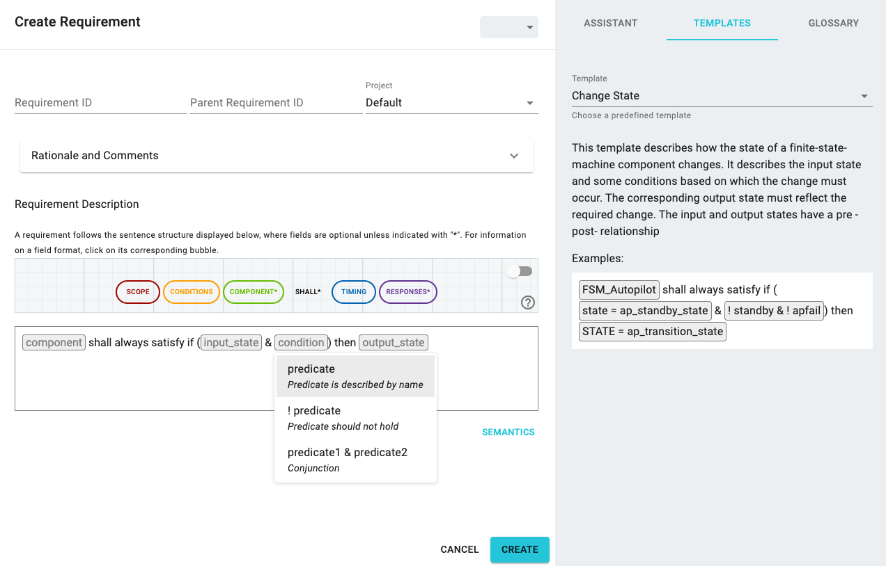

# How to create requirement templates in FRET

FRET provides templates to users for assisting writing certain types of requirements in the *TEMPLATES* tab of the right pane in the *Create Requirement* or *Update Requirement* dialog. Instructions on how to use the FRET templates are provided [here](../user-interface/writingReqs.md).

Additionally, a user may create their own templates by using the templates editor of FRET. New templates can be added in **fret\fret-electron\templates\basicTemplates.js**. Here is an example of an existing FRET template:

***

***

As shown in the above screenshot, a user can use the following functions to create a new template:
* `newTemplate`: Specifies the name of the template, e.g., Change State.
* `tenplateSummary`: Provides a summary of the template and what types of requirements it describes.
* `templateStructure`: Provides the FRETish text that will appear in the FRET requirement editor. Square brackets are used for fields that must be instantiated by the user, e.g., component, input_state, etc.
* `fieldDescription`: Provides a description of each field that must be instantiated by the user.
* `addOption`: Provides input options for each field that can be instantiated by the user. Notice that multiple options can be added for each such field, e.g., condition has three options.
* `addExample`: Provides an example of an instantiated requirement.

After a user has created a new template type, they must execute in a terminal under `fret-electron`:
1. `cd templates`
2. `node basicTemplates`

to create an updated `templates.json` file that is given as input to FRET.

The following screenshot shows how the **Change State** template is
displayed in FRET. Note the options for the condition field. 

***

***

[Back to FRET home page](../../userManual.md)
