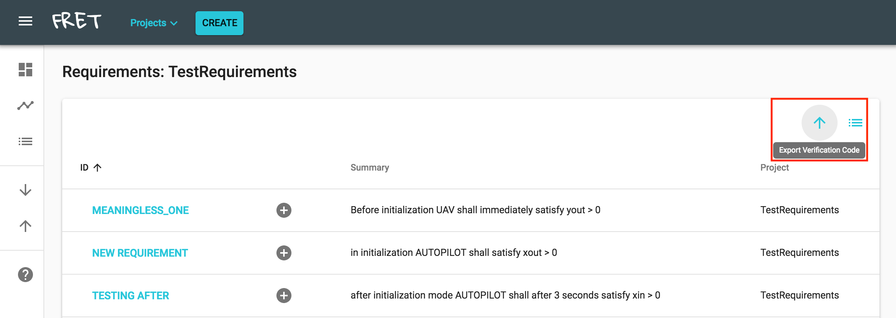
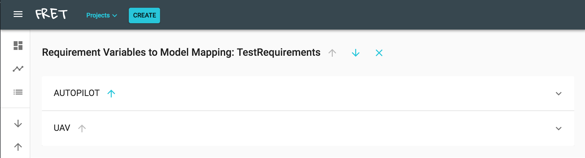
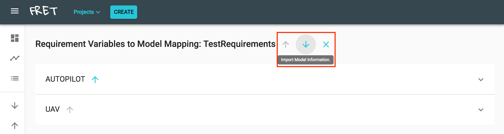
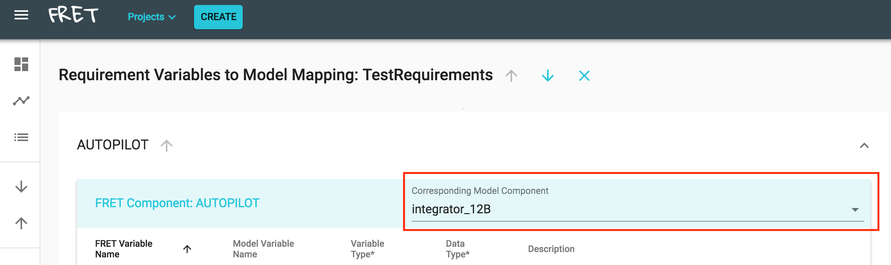
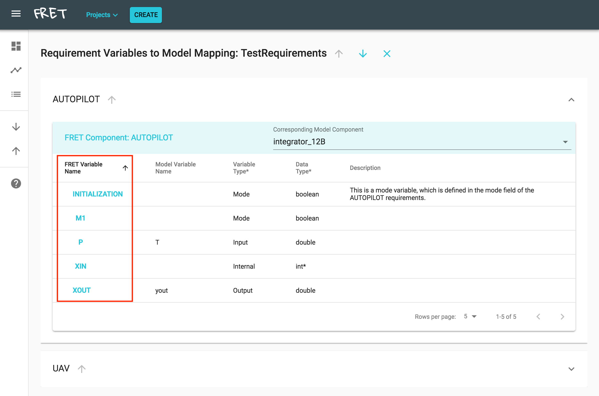
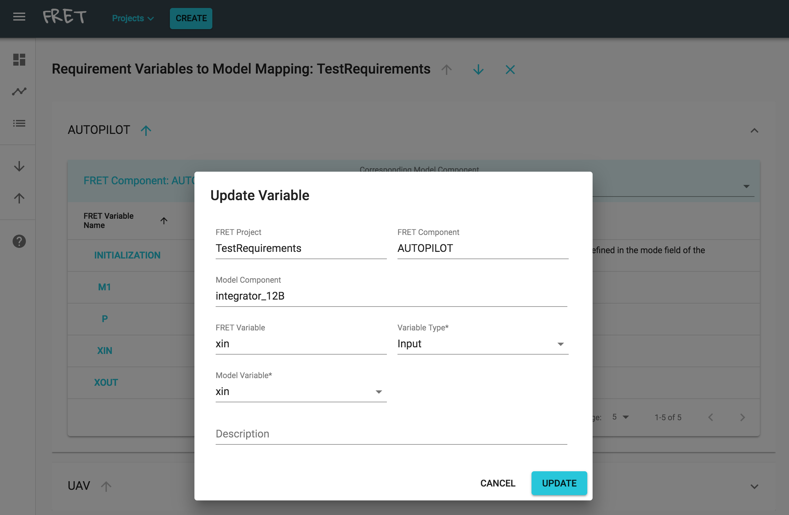
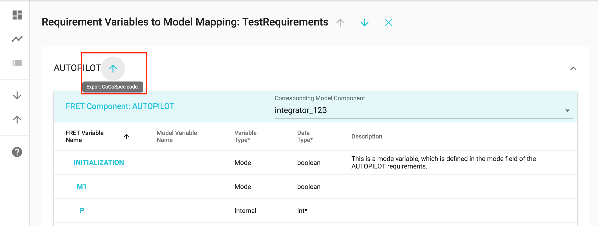
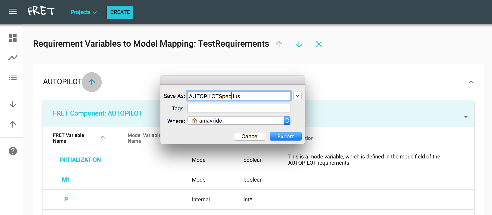

# Exporting to Analysis tools

FRET's main purpose is to facilitate the elicitation of unambiguous requirements. For analysis, it allows users to export requirements in formats that can be digested by other analysis tools.

We have connected FRET with [SMV](#smv), [Cocosim](#cocosim), and [Copilot](#copilot). We are also working on connected FRET with the [R2U2](#r2u2) tool.

[Back to FRET home page](../../userManual.md)

## Cocosim

To connect with the CoCoSim tool, we transform requirements into CoCoSpec code. The user, after providing additional variable information, can automatically generate CoCoSpec code and export it in the form of a Lustre file. The CoCoSpec code includes properties to be proven invariant and can be given as input to the SMT-based Kind2 model checker.

### The Lustre and CoCoSpec languages
 CoCoSpec is an extension of the synchronous dataflow language Lustre. System components are expressed in Lustre as `nodes` with inputs and outputs. Variables are used to represent `input`, `output`, and locally defined (`internal`) streams. Basic variable data types include `real` numbers, `integer` numbers, and `Booleans`. Additionally, `structure` and `enumerated` data types are supported. For the user that is familiar with Simulink data types, we provide a mapping between Simulink and Lustre data types in the following table:

 | Simulink data types | Lustre data types |
 | ------------- |:-------------:|
 | boolean    | bool |
 | int* (e.g., int8, uint8, int16, etc.)      | int      |
 | double | real      |
 | single | real      |
 | enum | enum      |
 | bus | struct      |

CoCoSpec extends Lustre by adding assume-guarantee contracts. Contract declarations are similar to Lustre nodes but are introduced with the `contract` keyword. The body of a contract may contain interval variable declarations, `assume` and `guarantee statements` and `mode declarations`. Modes consist of `require` and `ensure statements`. Statements can be any well-typed Lustre expressions of type _bool_.

For the user that is familiar with Simulink port types, we provide a mapping between Simulink port types and CoCoSpec variable types in the following table:

| CoCoSpec types | Simulink types |
| ------------- |:-------------:|
| Input    | Inport |
| Output      | Outport      |
| Mode | -      |
| Internal | -      |

CoCoSpec modes correspond to FRET scopes
([see FRET Syntax](../user-interface/examples/writingReqs.md)). CoCoSpec internal variables are used to define auxiliary local-to-the-component streams. For instance, if an expression on a set of variables (e.g., `x or y`) is being used frequently in a set of requirements, then the user may declare it as an internal variable (e.g., `xOry = x or y;`).

### A step-by-step guide for CoCoSpec code generation
To generate the CoCoSpec code of a component, which is defined in a set of requirements, additional information must be provided about the variables and modes of the component. To do that a user must follow the steps:

**1. Pick a project and switch to the Requirements table view**

Pick a project from the drop down menu (Project button) and switch to the Requirements table view by clicking the icon in the red box in the left hand side panel.

  

**2. Click on the Export Verification Code button**

The Export Verification code button is on the right top corner of the main FRET panel.

   

**3. Pick component and complete necessary variable information**

FRET automatically extracts all components, variables, and modes that have been specified in the requirements of a project. For each component it creates an accordion field that (if clicked) displays a table with the variables and the modes of that particular component.

  

To generate CoCoSpec code, additional mode- and variable-specific information needs to be entered by the user, i.e.,:
* IDs (automatically extracted from the requirements),
* data types (i.e., bool, int, real, enum, struct),
* types (i.e., input, output, internal, mode),
* descriptions,
* internal assignments
* mode require statements.

A user may optionally import information from a corresponding model and also make the mapping between the components/variables described in the requirements and the components/port types of the Simulink model. To do that, the user can optionally generate the model information in a compliant-to-FRET JSON format by using `fret_IR.m`. Then the JSON file can be imported into FRET by clicking the Import Model Information button.

  

If model information has been imported, the user may pick for each FRET component a corresponding model component from the dropdown menu on the upper right hand side of a table.

  

Next, for each variable, all mandatory fields must be completed. For each type of variable, i.e., `Input`, `Output`, `Internal`, and `Mode`, there are different mandatory fields. Mandatory fields are depicted with an asterisk. To complete the information of a variable, please click on the corresponding FRET Variable name.

  

Then a dialog with the complete information of this variable will pop up. To save the updated information please click on the `UPDATE` button.

  

**4. Click on the Export component code button and save the generated code**

Once all mandatory fields have been completed for all the variables/modes of a component, then the export button becomes enabled.

  

Once the export button is clicked, the generated code can be saved in the form of a Lustre file. This file can then be given as input to the Kind2 model checker.

  

___

## Copilot

[Copilot](https://copilot-language.github.io/) is a high-level runtime verification framework that produces hard real time C code. Among others, Copilot has been used by the Safety Critical Avionics Systems Branch of NASA Langley Research Center to monitor drone test flights.

___

## SMV

TBD.
___

## R2U2
TBD.
