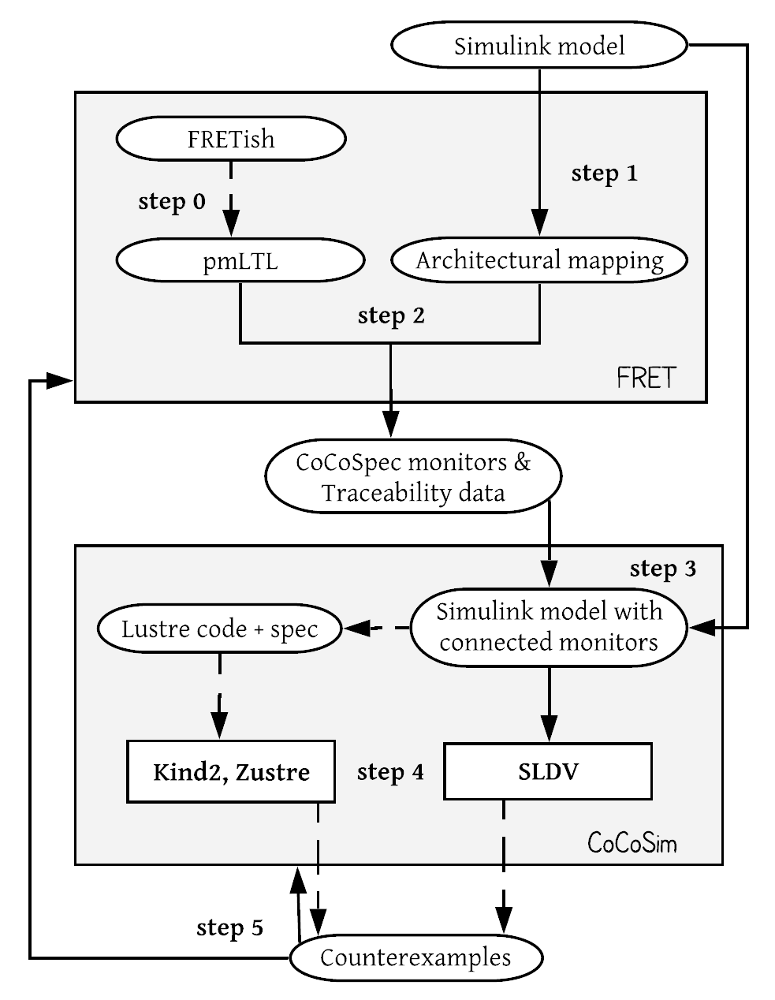

# Cocosim

[CoCoSim](https://github.com/NASA-SW-VnV/CoCoSim) is an open source framework for the analysis of Simulink/Stateflow models. CoCoSim translates a Simulink model into Lustre code, which is the intermediate language of CoCoSim. Then, CoCoSim annotates the generated Lustre code with assume-guarantee contracts that contain system requirements.  Verification can be performed in a compositional way by checking that component-level contracts imply those at system-level and/or by checking the component-level contracts against individual component behavior. Several Lustre-based analysis tools (e.g., Kind2, JKind, Zustre) integrated in CoCoSim can be used to check the validity of the generated Lustre nodes via SMT-based model checking. Additionally, Simulink-based analysis tools (e.g., SLDV) can also be used at the level of the Simulink models.

Through our FRET-To-CoCoSim integration, we allow users to write requirements using the intuitive language of FRET, automatically formalize them, and export assume-guarantee contracts along with traceability information that can be directly digested by CoCoSim.

In particular, our framework provides: 1) automatic extraction of Simulink model information and association of requirements with target model signal and components and 2) translation of FRET requirements into synchronous dataflow CoCoSpec specifications, as well as Simulink monitors.

## The Lustre and CoCoSpec languages
 CoCoSpec is an extension of the synchronous dataflow language Lustre. System components are expressed in Lustre as `nodes` with inputs and outputs. Variables are used to represent `input`, `output`, and locally defined (`internal`) streams. Basic variable data types include `real` numbers, `integer` numbers, and `Booleans`. Additionally, `structure` and `enumerated` data types are supported. For the user that is familiar with Simulink data types, we provide a mapping between Simulink and Lustre data types in the following table:

 | Simulink data types | Lustre data types |
 | ------------- |:-------------:|
 | boolean    | bool |
 | int* (e.g., int8, uint8, int16, etc.)      | int      |
 | double | real      |
 | single | real      |
 | enum | enum      |
 | bus | struct      |

CoCoSpec extends Lustre by adding assume-guarantee contracts. Contract declarations are similar to Lustre nodes but are introduced with the `contract` keyword. The body of a contract may contain interval variable declarations, `assume` and `guarantee statements` and `mode declarations`. Modes consist of `require` and `ensure statements`. Statements can be any well-typed Lustre expressions of type _bool_.

For the user that is familiar with Simulink port types, we provide a mapping between Simulink port types and CoCoSpec variable types in the following table:

| CoCoSpec types | Simulink types |
| ------------- |:-------------:|
| Input    | Inport |
| Output      | Outport      |
| Mode | -      |
| Internal | -      |

CoCoSpec modes correspond to FRET scopes
([see FRET Syntax](../user-interface/examples/writingReqs.md)). CoCoSpec internal variables are used to define auxiliary local-to-the-component streams. For instance, if an expression on a set of variables (e.g., `x or y`) is being used frequently in a set of requirements, then the user may declare it as an internal variable (e.g., `xOry = x or y;`).

## The FRET-CoCoSim integration workflow

The figure below shows the workflow of our framework.  In Step 0, requirements written in FRETish are translated by FRET into pure Past Time Metric Linear Temporal Logic (pmLTL) formulas. In Step 1, data is used from the model under analysis to produce an architectural mapping between requirement propositions and Simulink signals. In Step 2, the pmLTL formulas and the architectural mapping are used to generate monitors in CoCoSpec, which is an extension of the synchronous dataflow language Lustre for the specification of assume-guarantee contracts. In Step 3, the generated CoCoSpec monitors and model traceability data are imported into CoCoSim along with the Simulink model under analysis. CoCoSim automatically generates and attaches monitors to the Simulink model. From the complete model (initial model and attached monitors), CoCoSim also generates equivalent Lustre code. As a result, the complete model can be analyzed by both Simulink-based (e.g., Simulink Design Verifier (SLDV)) and Lustre-based (e.g., Kind2, Zustre) verification tools in Step 4. Counterexamples generated during the analysis can be traced back to CoCoSim or FRET for simulation in Step 5.

***

## Related papers

* [Bridging the Gap Between Requirements and Simulink Model Analysis](https://ntrs.nasa.gov/citations/20200002240).

***
