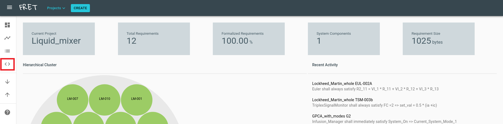
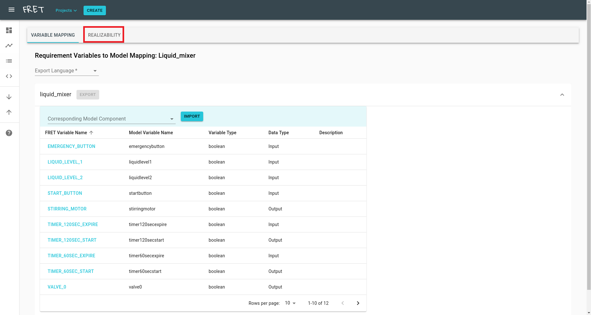
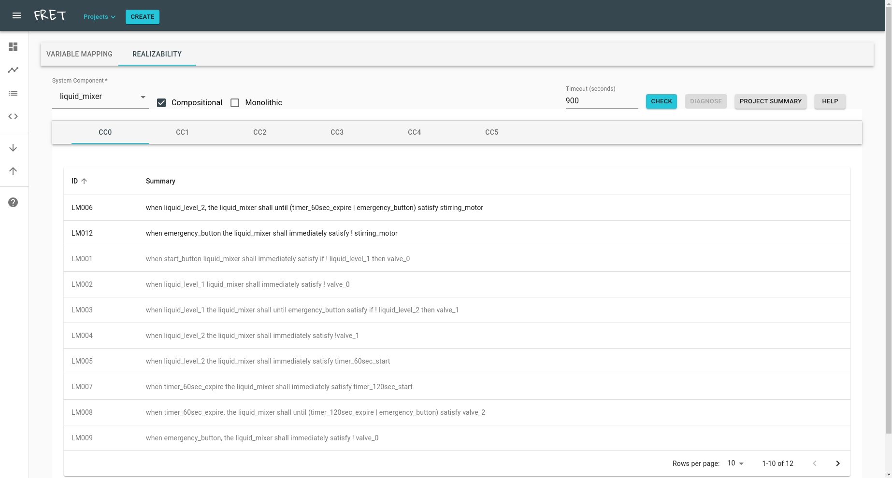
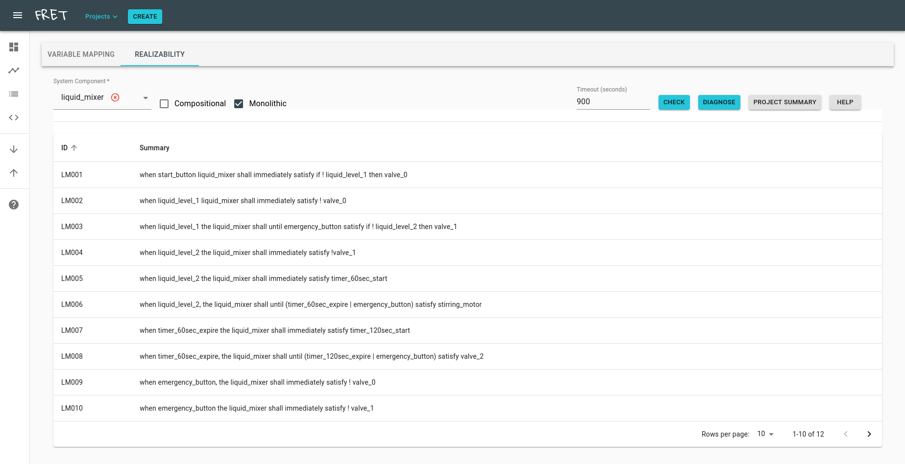
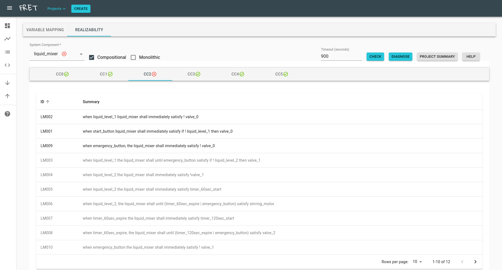
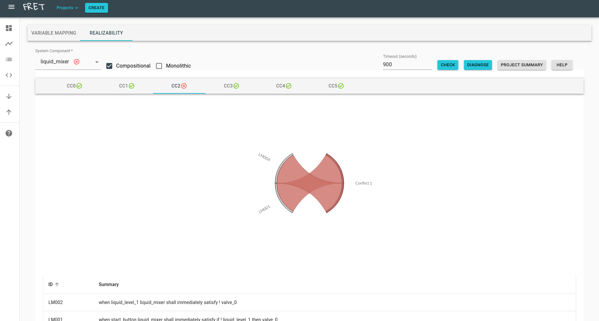
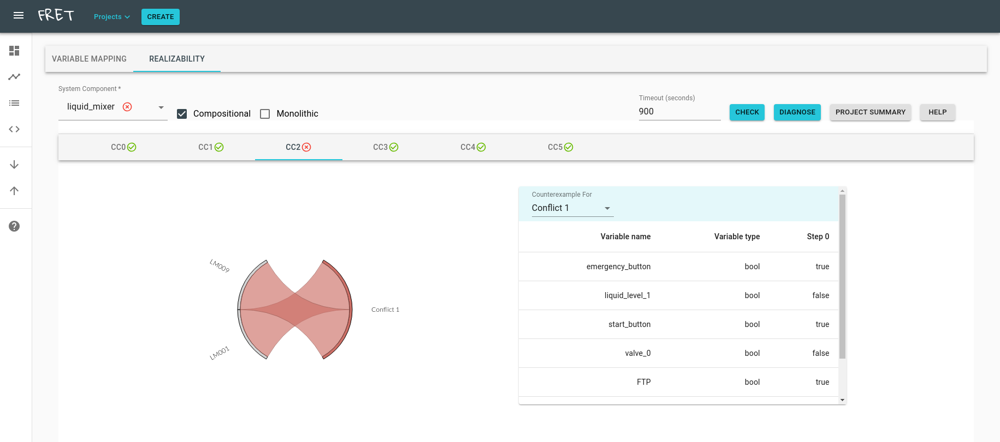
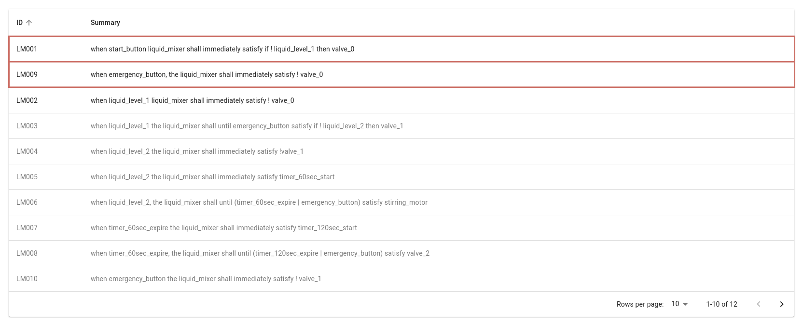

# Realizability Checking

FRET supports formal analysis of requirements in the form of realizability checking. A set of requirements for a system component is realizable if an implementation of the component exists, such that it conforms to the requirements, given any input from the system's environment. Realizability as a notion is stronger, compared to the more commonly used analysis of requirements consistency, as the latter only examines whether the requirements are satisfiable for a single combination of inputs.

In addition to a traditional monolithic realizability check, FRET provides a powerful alternative in the form of compositional analysis. Whenever applicable, the original set of component requirements is automatically analyzed to be decomposed into smaller connected components. Each connected component is a set of requirements expressed over only a portion of the original system outputs. Connected components enable the compositional analysis of the original component, yielding better performance of the underlying checks while providing a clearer picture of dependencies between requirements.

Realizability checking can be accessed through the Analysis Portal and is performed over a single system component within a FRET project. Before checking a component for its realizability, all of its variables need to be mapped using the Variable Mapping tab in the portal. The user can then access the Realizability tab to check the component, as well as diagnose it, for the unrealizable cases.

## Dependencies

Note : Realizability checking is not currently supported for Windows

Three dependencies exist for realizability checking:

* JKind with JRealizability. JKind is an infinite-state model checker, which has been extended with realizability checking support. To install JKind with JRealizability, download `jkind.jar`, `jkind`, `jrealizability` and `jlustre2kind` from the [the latest release](https://github.com/andrewkatis/jkind-1/releases/latest), put the downloaded files to a folder of your choice and add the path to the folder to your PATH environment variable.

* AE-VAL. AE-VAL is a SMT solver for forall-exists formulas, and is used for the realizability queries generated by JRealizability. Install AE-VAL by [cloning the official repository](https://github.com/grigoryfedyukovich/aeval) and building from source.

* Z3. Z3 is another SMT solver, used by JRealizability to perform simplifications over complex formulas. To install Z3, download [the latest release](https://github.com/Z3Prover/z3/releases), extract and add the location of the binary to your PATH environment variable.

## A step-by-step guide to checking realizability

To check a system component's set of requirements for realizability, the user must follow the steps:

**1. Pick a project and switch to the Analysis Portal**

Pick a project from the drop down menu (Project button) and switch to the Analysis Portal by clicking the icon in the red box in the left hand side panel.

**2. Pick component and complete necessary variable information under Variable Mapping**

You do not need to use the export option at this time.

**3. Switch to the Realizability view**

Switch to the Realizability view by clicking the tab in the red box.

**4. Pick a component**

Pick a System Component. The realizability tab should now update to show the following information:

* Connected Components (if applicable). If the system can be decomposed, its connected components are displayed, named after CCX, where X is used for indexing. Each connected component has a dedicated tab for requirements inspection and diagnosis.
* Requirements table. When in monolithic mode, the table simply lists the entire set of requirements. When in compositional mode, the table lists the requirements related to the selected connected component. Unrelated requirements are still displayed but are grayed out.
* Compositional and Monolithic options. For components that can be decomposed into connected components, the compositional option is available to perform realizability checking per connected component. Otherwise, only the monolithic option is enabled.
* Check button. Use this button to perform realizability checking (compositional or monolithic).
* Diagnose button (unrealizable components only). If the component is unrealizable, use this button to identify minimal sets of conflicting requirements, as well as view their counterexamples (see also step "Diagnoe unrealizable requirements" below).
* Project Summary and Help buttons (Currently disabled features, coming soon).

**5. Check Realizability**

If applicable, select an option between compositional and monolithic checks and click on the Check button.

**5.1 Monolithic check**

When the check is complete, a result icon is displayed next to the name of the selected system component. Hover over the icon to view the time required for the analysis to complete. For unrealizable results, the Diagnose button should be now available.

**5.2 Compositional check**

A check is performed per connected component. Once all checks are done, the results are displayed next to the name of the corresponding connected component, as well as the name of the system component. For unrealizable connected components, the Diagnose button becomes available when the corresponding tab is picked.

**6. Diagnose unrealizable requirements**

Unrealizable sets of requirements can now be diagnosed. The diagnosis procedure identifies minimal sets of conflicting requirements. A graphic interface allows you to focus to specific minimal conflicts and observe their counterexample.

Select an unrealizable component (or connected component) and click the Diagnose button. When the analysis is complete, the main window is updated with a chord diagram. The chord diagram is a visual representation of the minimal conflicts that exist in the component, and can be manipulated to focus on particular conflicts.

Select a conflict on the diagram by clicking on the corresponding conflict label to view the participating requirements, as well as its counterexample table. The counterexample displays a system execution where at least one requirement can be violated, given specific inputs from the environment.

The requirements table is also updated when a conflict is selected. The participating requirements are filtered to appear towards the top of the table, and are outlined by the corresponding color of the conflict in the diagram.

