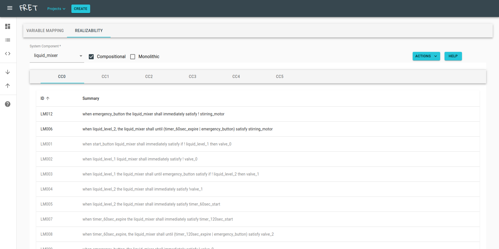
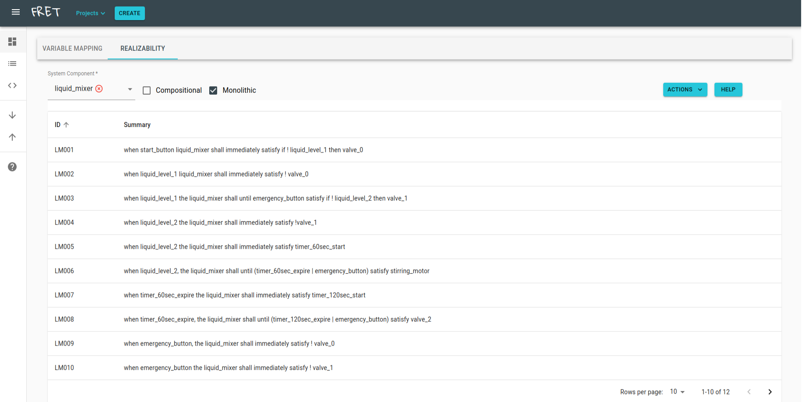
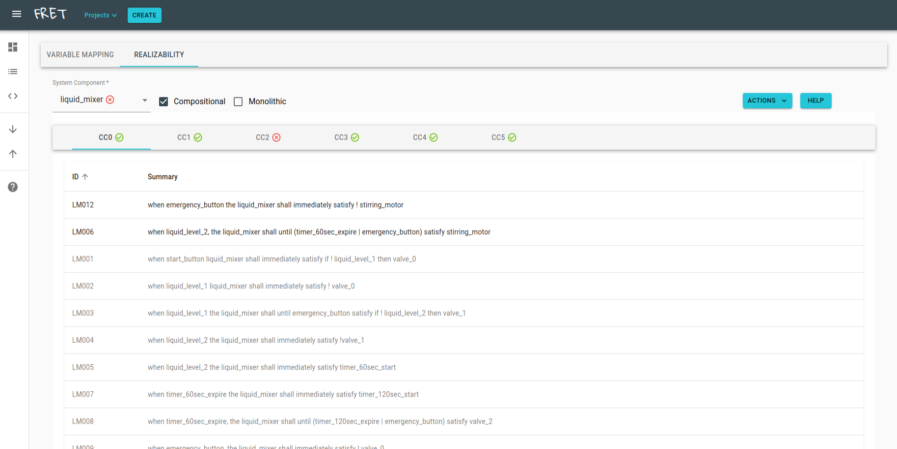
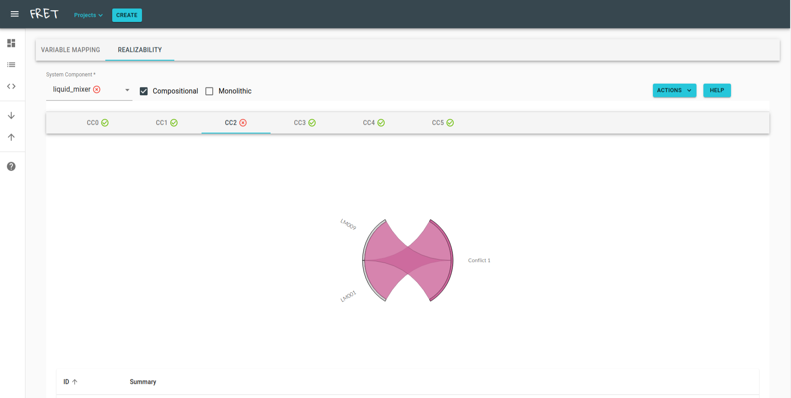
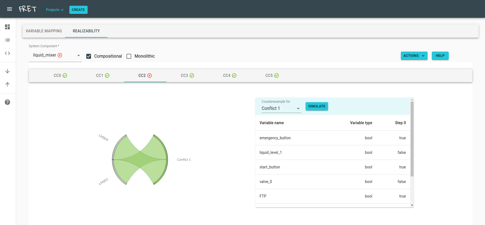
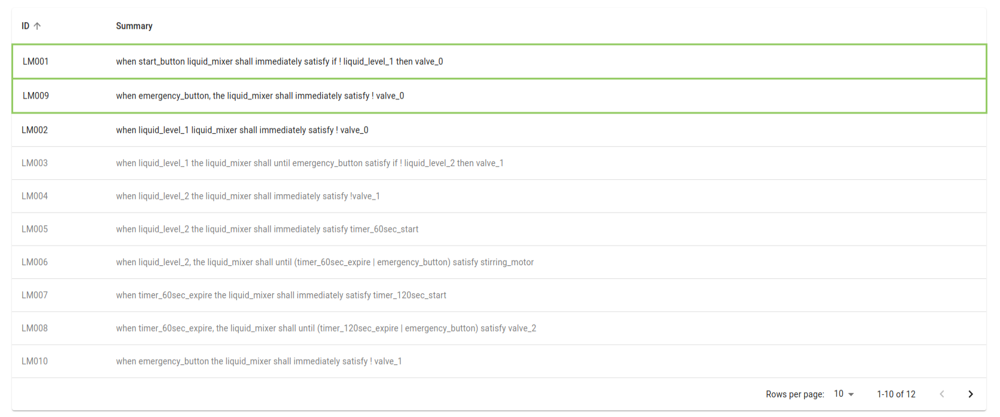

# Realizability Checking

FRET supports formal analysis of requirements in the form of realizability checking. A set of requirements for a system component is realizable if an implementation of the component exists, such that it conforms to the requirements, given any input from the system's environment. Realizability as a notion is stronger, compared to the more commonly used analysis of requirements consistency, as the latter only examines whether the requirements are satisfiable for a single combination of inputs.

In addition to a traditional monolithic realizability check, FRET provides a powerful alternative in the form of compositional analysis. Whenever applicable, the original set of component requirements is automatically analyzed to be decomposed into smaller connected components. Each connected component is a set of requirements expressed over only a portion of the original system outputs. Connected components enable the compositional analysis of the original component, yielding better performance of the underlying checks while providing a clearer picture of dependencies between requirements.

Realizability checking can be accessed through the Analysis Portal and is performed over a single system component within a FRET project. Before checking a component for its realizability, all of its variables need to be mapped using the Variable Mapping tab in the portal. The user can then access the Realizability tab to check the component, as well as diagnose it, for the unrealizable cases.

## Dependencies

Note : Realizability checking is not currently supported in native Microsoft Windows installations.

Note : Depending on your setup, you may need to change permissions for the downloaded files to be executable by your user account. For example, in Linux you may have to run `chmod u+x <file>` for each of the downloaded binaries and scripts.

Our interface provides four different configurations with which realizability checking can be performed: "JKind", "JKind + MBP", "Kind 2" and "Kind 2 + MBP". "MBP" stands for Model Based Projection, a procedure that can be used to approximate quantifier elimination. The "MBP" configurations tend to be inferior in performance overall, but may solve problems that standard quantifier elimination cannot.

Depending on the configuration, the following dependencies must be installed:

* JKind ("JKind", "JKind + MBP"). To install JKind with JRealizability, make sure to have at least Java 11 installed. Then, download `jkind.jar`, `jkind`, `jrealizability` and `jlustre2kind` from the [the latest release](https://github.com/andrewkatis/jkind-1/releases/latest), put the downloaded files to a folder of your choice and add the path to the folder to your PATH environment variable.

* Kind 2, v1.5.1 or later ("Kind 2", "Kind 2 + MBP"). To install Kind 2, please follow any of the available options mentioned [here](https://github.com/kind2-mc/kind2/blob/develop/README.rst) to download or build a binary, and add the path of the binary to your PATH environment variable.

* Z3 SMT solver (required for all configurations). To install Z3, download any stable release from [here](https://github.com/Z3Prover/z3/releases), extract and add the location of the binary to your PATH environment variable.

* AE-VAL ("JKind + MBP"). AE-VAL is a SMT solver for forall-exists formulas, and is used for the realizability queries generated by JKind. Install AE-VAL by [cloning the official repository](https://github.com/grigoryfedyukovich/aeval) and building from source. Add the built binary to your PATH environment variable.

## Notes
- Realizability checking is only supported for System components that include variables of `Input`,`Output` and `Internal` variable type. Support for `Function` variable types is limited to requirements that use Lustre nodes from the pre-defined nodes library under `fret-electron/support/CommonTemplates/LibraryOfOperators.ejs`.
- Leaving the REALIZABILITY CHECKING tab at any time (including during analysis) will reset all results.
- While a realizability checking or diagnostic analysis is running, users can perform the following actions without affecting the analysis:

    1. If in Compositional view, navigate through the connected component tabs (CC).
    2. Write comments in the field under the 'Comments' accordion, to be saved to a realizability analysis report.
    3. Interact with the requirements table e.g., to sort requirements or switch table page.
    4. Import/Export Project requirements and variables using the corresponding options from the sidebar.
    5. Open the realizability analysis manual, by clicking on the 'HELP' button.

## A step-by-step guide to checking realizability

Note: In the past, we have encountered arbitrary analysis failures when using JKind and Z3, during which Z3 crashes with a segmentation fault. If you encounter this issue, please switch to an alternative engine setting, or try running the analysis again.

Experimental Feature: Requirements can be designated as environment assumptions by adding the word `assumption` in the requirement ID.

To check a system component's set of requirements for realizability, the user must follow the steps:

### **1. Pick a project and switch to the Analysis Portal**

Pick a project from the drop down menu (Project button) and switch to the Analysis Portal by clicking the icon in the red box in the left hand side panel.

&nbsp;&nbsp;&nbsp;&nbsp;

### **2. Pick component and complete necessary variable information under Variable Mapping**

Variable Mapping is necessary to designate the variable types (inputs, outputs, internal variables, etc.), as well as their data types (integer, double, boolean, etc.). For internal variables, an assignment must also be given, using the [Verimag Lustrev6 syntax](https://www-verimag.imag.fr/DIST-TOOLS/SYNCHRONE/lustre-v6/doc/lv6-ref-man.pdf).

You do not need to use the export option at this time.

### **3. Switch to the Realizability view**

Switch to the Realizability view by clicking the tab in the red box.

&nbsp;&nbsp;&nbsp;&nbsp;

### **4. Pick a component**

Pick a System Component. The realizability tab should now update to show the following information:

* Connected Components (if applicable). If the system can be decomposed, its connected components are displayed, named after CCX, where X is used for indexing. Each connected component has a dedicated tab for requirements inspection and diagnosis.
* Requirements table. When in monolithic mode, the table simply lists the entire set of requirements. When in compositional mode, the table lists the requirements related to the selected connected component. Unrelated requirements are still displayed but are grayed out.
* Compositional and Monolithic options. For components that can be decomposed into connected components, the compositional option is available to perform realizability checking per connected component. Otherwise, only the monolithic option is enabled.
* "Actions" button. Use this button to perform the following actions:
  * Check Realizability. Click to perform realizability checking (compositional or monolithic).
  * Diagnose Unrealizable Requirements. If the component is unrealizable, use this option to identify minimal sets of conflicting requirements, as well as view their counterexamples (see also step "Diagnose unrealizable requirements" below).
  * Save Report. Choose this option to save the analysis results into a JSON file.
  * Change Settings. Click to change the following settings:
    * Engine: Choose between the four available configurations (see "Dependencies" section).
    * Timeout (seconds): Set a timeout value for the analysis. The default value is 900 seconds.
    * Retain Analysis Files (for debugging purposes): Enable this option to retain intermediate input files for JKind and Kind 2.  Files are saved under `Documents/fret-analysis`.
* "Help" button. Use this button to display this documentation.

&nbsp;&nbsp;&nbsp;&nbsp;

### **5. Check Realizability**

If applicable, select an option between compositional and monolithic checks and click on "Actions" -> "Check Realizability".

#### **5.1 Monolithic check**

When the check is complete, a result icon is displayed next to the name of the selected system component. Hover over the icon to view the time required for the analysis to complete. For unrealizable results, the "Diagnose Unrealizable Requirements" option should now be available under "Actions".

&nbsp;&nbsp;&nbsp;&nbsp;

#### **5.2 Compositional check**

A check is performed per connected component. Once all checks are done, the results are displayed next to the name of the corresponding connected component, as well as the name of the system component. For unrealizable connected components, the "Diagnose Unrealizable Requirements" option under "Actions" becomes available when the corresponding tab is picked.

&nbsp;&nbsp;&nbsp;&nbsp;

### **6. Diagnose unrealizable requirements**

Unrealizable sets of requirements can now be diagnosed. The diagnosis procedure identifies minimal sets of conflicting requirements. A graphic interface allows you to focus to specific minimal conflicts and observe their counterexample.

Select an unrealizable component (or connected component) and click on "Actions" -> "Diagnose Unrealizable Requirements". When the analysis is complete, the main window is updated with a chord diagram. The chord diagram is a visual representation of the minimal conflicts that exist in the component, and can be manipulated to focus on particular conflicts.

&nbsp;&nbsp;&nbsp;&nbsp;

&nbsp;&nbsp;&nbsp;&nbsp;

Select a conflict on the diagram by clicking on the corresponding conflict label to view the participating requirements, as well as its counterexample table. The counterexample displays a system execution where at least one requirement can be violated, given specific inputs from the environment.

As soon as a counterexample is displayed, the "Simulate" button becomes available next to the name of the conflict. Click "Simulate" to invoke LTLSim and perform an interactive simulation between the conflicting requirements. For more information on how to use LTLSim, please read ["Using the Simulator"](../UsingTheSimulator/ltlsim.md) in the FRET user manual.

&nbsp;&nbsp;&nbsp;&nbsp;

&nbsp;&nbsp;&nbsp;&nbsp;

The requirements table is also updated when a conflict is selected. The participating requirements are filtered to appear towards the top of the table, and are outlined by the corresponding color of the conflict in the diagram.

&nbsp;&nbsp;&nbsp;&nbsp;

&nbsp;&nbsp;&nbsp;&nbsp;

## Selecting requirements for realizability checking

Users can select which requirements in a given system component should be considered for the purposes of analysis, allowing thus realizability checking and diagnosis for subset requirements.

After selecting a system component, users can deselect requirements by clicking on their corresponding row in the requirements table. After the new set of requirements has been identified, click on the "Apply" button to confirm the selection. The interface is updated, considering the new set of requirements. This may lead to new results with respect to connected components analysis. All previous analysis results are cleared, and analysis can be performed for the new set using the steps outlined in the previous section.

## Saving and loading realizability checking results

FRET provides means to save a report containing the current results of a given analysis, including a) connected component analysis, b) realizability results and c) diagnostic results. Reports are currently saved using the JSON format. To save a report for a given project, click on "Actions" -> "Save realizability results". In the new window, select a path in your system to save the report in. Provide a name for the report and click on "Save".

Users are also able to load saved reports and inspect them in FRET. Loaded reports are not associated with existing projects in the database. In other words, reports can be loaded even though the original project is not part of the FRET database. To load a report, click on the "Projects" button and select "All Projects". Then, navigate to the realizability tab in the Analysis Portal, and click on the "Load" button. In the new window, select the report to be loaded and click on "Load". The report should now be accessible using the graphical interface.

## Simulate realizable requirements

Note: This option is currently available only when using the 'JKind' engine option to check realizability.

When a specification is declared as realizable, users can observe an indicative execution trace of bounded length, guaranteed to preserve the satisfaction of all involved requirements. To do so, click on "Actions", and then "Simulate Realizable Requirements". The trace is displayed within an instance of LTLSim, and can be further modified using the standard LTLSim interface.

Users can specify the length of the trace, before checking realizability. Click on "Actions", "Change Settings" and modify the trace length value under the applicable engine option.

[Back to FRET home page](../userManual.md)