# Test Case Generation

FRET supports test case generation from requirements written in FRETish. The test case generation engine is based on the FLIP requirements coverage criterion, which provides a formal definition of test adequacy based on the atomic propositions (variables) that appear in the Linear Temporal Logic (LTL) formula of each requirement.

The FLIP coverage criterion is based on transformation rules that extend the original LTL formula of each requirement, with additional constraints that attempt to expose the unique effect of each atomic proposition in the original LTL formula. The result of this transformation is a set of new LTL formulas, one per atomic proposition, called *test obligations*. The test obligations are amenable to test case generation via model checking.

Given a requirement, the result of model checking its FLIP test obligations is a set of tests, where each test case attempts to expose the unique effect of each atomic proposition in the LTL formula. Some atomic proposition may be covered by the same test. For such cases, to minimize the size of the resulting test suite, FRET retains only one copy of the associated test.

Accompanying the main test case generation task are the following features:

1. Inspection of generated tests using the interactive simulator LTLSIM.
2. Export of generated tests in JSON format.
3. (Through the Variable Mapping Tab) Export of FLIP test obligations in CoCoSpec (Lustre) or SMV.

## Notes

- When using the NuSMV engine, FRET utilizes the finite trace Future-Time LTL formulas of each requirement for generating tests. When using the Kind 2 engine, FRET utilizes the Past-Time LTL formulas, instead.
- For the NuSMV engine, users can determine the length of the generated tests using the corresponding option in the settings. The minimum allowed length value is 4 steps. Values smaller than 4 are ignored and the underlying analysis proceeds with the default value 4 as a result.
- Only components that include variables of `Input`, `Output` or `Internal` variable type are currently supported for test case generation. For exporting of test obligations, we additionally support variables of `Function` variable type. For exports including `Function` variables, users need to define the variable's corresponding SMV module in the exported `.smv` files.
- The NuSMV engine can only be used with System components that include variables of 'boolean' Data Type.
- The NuSMV engine should not be used for requirements using Past-Time predicates `persisted` and `occured`.
- Exported test cases using the `Export Test Cases` option cannot be loaded in LTLSIM. To export test cases in a LTLSIM-compatible format use the corresponding export options from within the LTLSIM window. 
- For existing projects, you may encounter issues either in test case generation or test obligation exports, due to outdated information in the FRET databases. To resolve such issues, you may need to update the  variables in Variable Mapping. For `Internal` variables, make a minor modification to each assignment (such as deleting and re-adding the last character in the assignment), and click on `UPDATE`. For `Input` or `Output` variables, open the relevant variables and click on `UPDATE`.

## Dependencies

Dependencies, listed by engine option, are provided below:

- 'Kind 2': The [Kind 2](https://kind2-mc.github.io/kind2/)  model checker and the [Z3](https://github.com/Z3Prover/z3)  theorem prover must be installed. Latest known supported version for Kind 2 is v2.2.0, and v4.14.1 for Z3.
- 'NuSMV': The [NuSMV](https://nusmv.fbk.eu/) model checker must be installed. Latest known supported version is v2.7.0.

## A step-by-step guide to generating tests from FRETish

1. Select a specific project to work on. For this guide we are sing the Liquid Mixer case study, which is available in this repository under `fret/caseStudies/LiquidMixer/LM_reqts_and_vars.json`.

2. From the dashboard window, access the Analysis Portal (click on button outlined with red in the screenshot below).

&nbsp;&nbsp;&nbsp;&nbsp;

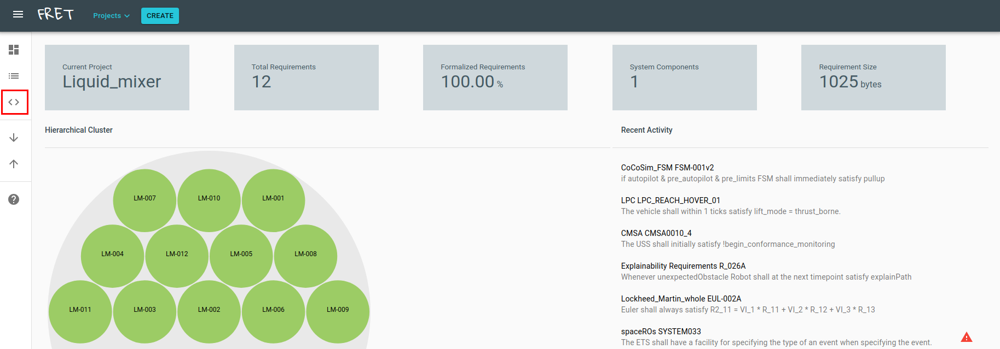

3. In the Variable Mapping Portal, ensure that your System Component of preference has a complete variable information. Keep in mind that only components that involve variables of `Input` or `Output` variable type and `boolean` data type are currently supported.

4. After the variable information has been completed, click on the Test Case Generation tab (outlined with red in image below).

&nbsp;&nbsp;&nbsp;&nbsp;

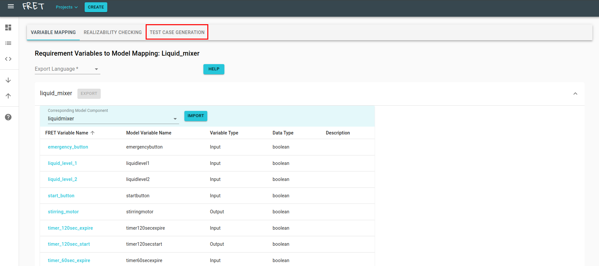


5. In the Test Case Generation tab, select the system component of preference.

&nbsp;&nbsp;&nbsp;&nbsp;

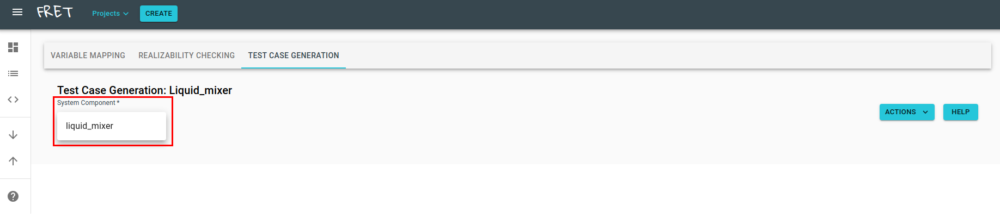

6. Optional: Select a subset of requirements to generate tests for. Please note that as requirements are removed important behavior constraints may be removed resulting in test cases with more general behavior. Apply your selection by clicking on the Apply button (outlined with red below).

&nbsp;&nbsp;&nbsp;&nbsp;

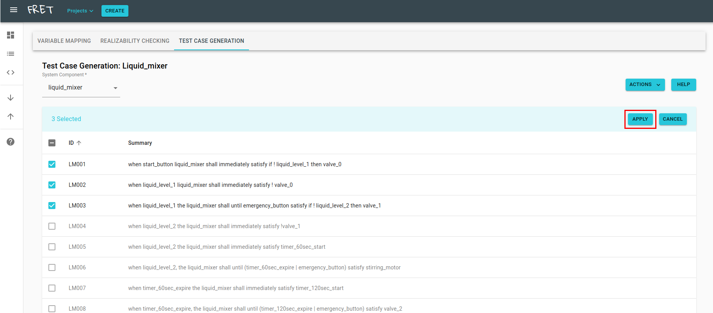

7. To generate tests, click on the Actions button and select the Generate Test Cases option (outlined with red below). We advise not to exit the Test Case Generation tab while tests are generated, as this will lead to all progress being lost.

&nbsp;&nbsp;&nbsp;&nbsp;

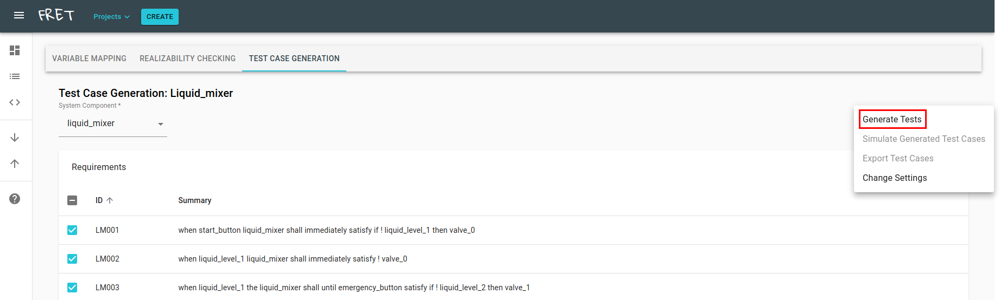

8. When the test case generation process is complete, a message will appear with additional information (currently time elapsed and number of tests generated).

&nbsp;&nbsp;&nbsp;&nbsp;

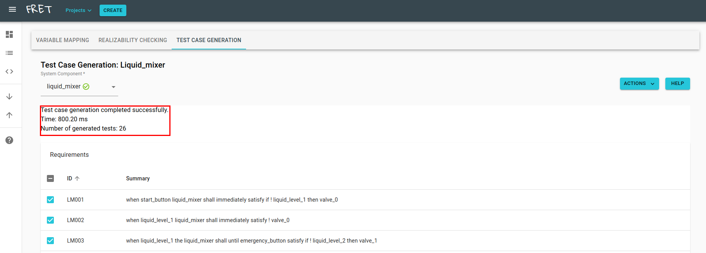

9. The generated tests can be viewed using the LTLSIM interactive window. Click the Actions button and choose the Simulate Generated Tests option. Note that this action may take several seconds to complete as tests are loaded in the simulator.

&nbsp;&nbsp;&nbsp;&nbsp;

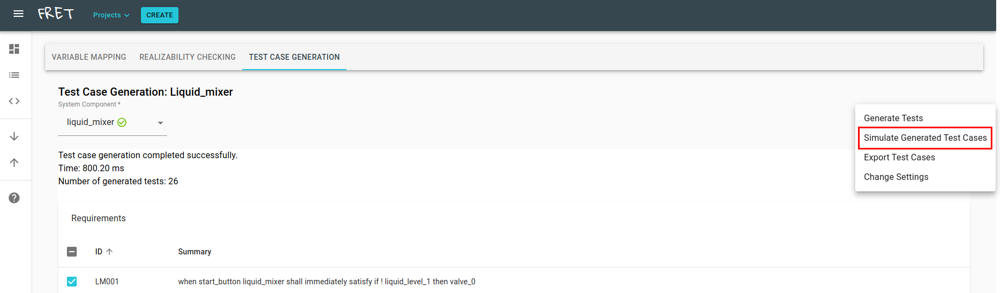

10. In the LTLSIM Dialog, click the Trace button (outlined with red below) to see the list of generated tests.

&nbsp;&nbsp;&nbsp;&nbsp;

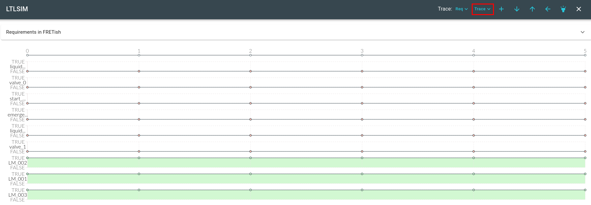

11. Select any test from the list.

&nbsp;&nbsp;&nbsp;&nbsp;

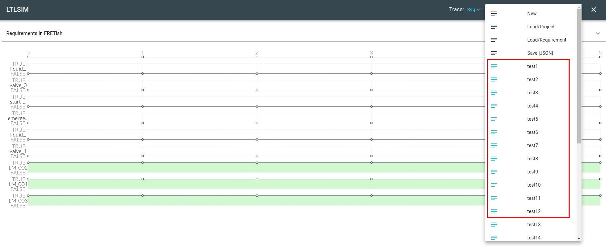

12. Observe the generated test. Further interaction with the tests is also available, using the standard simulator functions.

&nbsp;&nbsp;&nbsp;&nbsp;

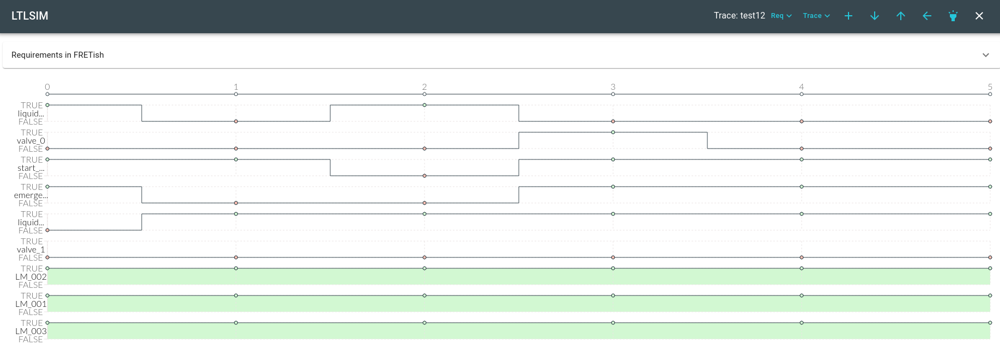

13. Finally, tests can be exported in JSON format by returning to the Test Case Generation view, clicking on the Actions button and choosing the option Export Test Cases.


## Export Test Cases - Additional Information

Currently the exported JSON file uses the following format to save test cases:

```
[
    #Array of tests. Each test is an object with two properties.
    #testID: Identifier of test.
    #testTrace: The generated trace for the test.
    {
        "testID": "test1",
        "testTrace": {
            "traceLength": i, #i: Positive integer designating the length of the test trace.            
            "keys": [
                #Array of variable names in system component                
            ],
            "values": [
                #Array of time step arrays. Each time step array 
                #refers to one time step of the test 
                #(currently limited to 6 steps).                
                [
                    #The values of each time step array refer to the
                    #truth (0 or 1) of each variable, in the order that
                    #they appear in the "keys" array, at the corresponding
                    #time step.
                ],
                ...
            ]
        }
    },
    ...
]
```

## Export Test Obligations

In order to generate tests using external Lustre/CoCoSpec or NuSMV backends, users have the option to export the corresponding test obligations. For Lustre exports only the Past-Time LTL obligations can be generated.

Note: For the SMV `Future-Time LTL - Finite Trace` export option, the resulting files require additional definitions in order to designate when the end of execution is observed, by setting the `LAST` boolean flag to true. For example, in order to evaluate the obligations on consider execution traces up to a predefined number of steps, say 6, one can manually add a definition for a step counter as follows:

```
VAR
    --Declare step counter in the list of variable declarations.
    t : 0 .. 5;
ASSIGN
    --Define behavior of step counter in ASSIGN block.
    init(t) := 0;
    next(t) := (t >= 5) ? 5 : t + 1;
```

and define `LAST` to be true at the sixth step as follows:

```
DEFINE
    --Add definition of LAST in DEFINE block.
    LAST := case
        t <= 4 : FALSE;
        TRUE   : TRUE;
    esac;
```

To export test obligations follow these steps (use screenshots below as reference to each step):

1. Move to the Variable Mapping tab in the Analysis Portal
2. Select the Export Language (only CoCoSpec and SMV are currently compatible).
3. Click on the Export button next to the System Component accordion of your preference.
4. If SMV is used, choose between obligations in Future-Time or Past-Time LTL.
5. Save the obligations to a `.zip` file in the directory of your choice. The file will contain one file per requirement, containing the requirements' corresponding obligation formulas.

&nbsp;&nbsp;&nbsp;&nbsp;

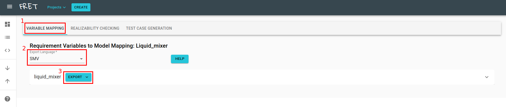

&nbsp;&nbsp;&nbsp;&nbsp;

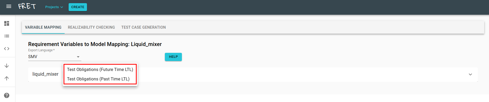