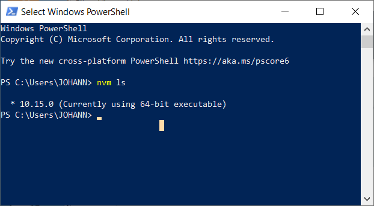
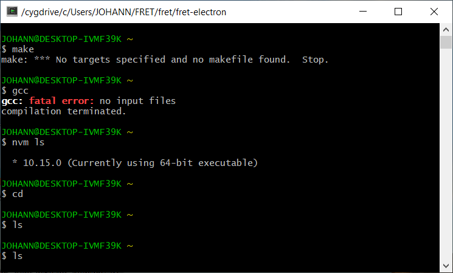
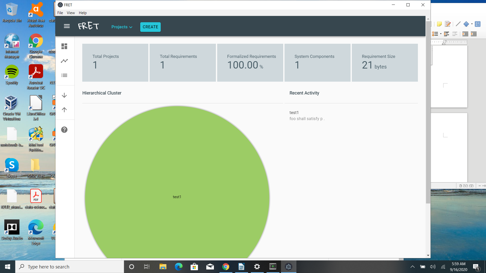

# Installing FRET on Windows

These installation instructions describe the installation of FRET
on Windows. Two options are provided; installing using 1) [Windows Subsystem for Linux (WSL)](#windows-subsystem-for-linux-wsl) or 2) [Cygwin](#cygwin).

## Windows Subsystem for Linux (WSL)

### Prerequisites

**FRET can only be used with WSL 2**. A full official Microsoft guide to installing WSL 2 can be found [here](https://learn.microsoft.com/en-us/windows/wsl/install). New Linux installations are set to WSL 2 by default. If you want to install FRET on an existing Linux distribution, make sure to check that it is set to WSL 2. For more details on how to check and upgrade from WSL 1 to WSL 2, follow this [guide](https://learn.microsoft.com/en-us/windows/wsl/install#upgrade-version-from-wsl-1-to-wsl-2).

We have succesfully installed FRET in Ubuntu distributions using the official Microsoft guide above. **The rest of this guide assumes that an Ubuntu WSL installation is used.** For most users, a full WSL Ubuntu installation can be performed by running the following command in a Windows Powershell or Command Prompt terminal:

```
wsl --install
```

If you wish to use a different distribution, but encounter issues with the current guide, please contact us or create a Github Issue ticket.

After WSL and an Ubuntu distribution have been installed, open the WSL terminal (you can search for "wsl" using Windows' standard search functionality) to access the Ubuntu distribution. You can then proceed to install the required dependencies, mentioned in [the first page of our installation guide](installationInstructions.md#dependencies), using standard Ubuntu package installation commands (e.g. `sudo apt install gcc`). Please note that this step needs to be performed from within the Ubuntu distribution. **It is not necessary to install the Windows versions of these dependencies**.

Since this is a clean Ubuntu installation, it may be the case that `git` is not an available command. Install it via:

```
sudo apt install git
```

Since FRET's main functionalities are provided via its Graphical User Interface (GUI), it is necessary to ensure that appropriate **Windows** graphics software drivers have been installed. For further details, consult this Microsoft [guide](https://learn.microsoft.com/en-us/windows/wsl/tutorials/gui-apps). If you encounter GUI-related issues, you may need to update your graphics drivers or WSL installation to the latest possible version. Otherwise, consult this [Github Issue thread](https://github.com/microsoft/wslg/issues/1148) for further insights.

After all the required dependencies have been installed, clone the FRET repository using `git` to a directory of your choosing, and proceed with the standard installation steps:

```
git clone https://github.com/NASA-SW-VnV/fret.git
cd fret/fret-electron
npm run fret-install
```
Finally, run FRET:

```
npm start #(or npm start --no-sandbox, if you encounter issues with Ubuntu 22.04 LTS or later)
```

To install optional dependencies ( [NuSMV](http://nusmv.fbk.eu/),
 [JKind](https://github.com/andrewkatis/jkind-1/releases/latest),
 [Kind 2](https://github.com/kind2-mc/kind2/blob/develop/README.rst),
 [Z3](https://github.com/Z3Prover/z3/releases) ), do so using their **Linux** binaries. From within the WSL Ubuntu distribution, download the respective binary to a folder of your choice and make it accessible by adding its full path to the distribution's PATH environment variable. For further details, consult our [Notes](installationInstructions.md#notes) section.

## Cygwin

### Prerequisites

The following software packages must be installed.

* install git.
  Git is available from https://git-scm.com/download/win

* install python 2.7 from https://www.python.org/downloads/release/python-2718/ or 3.10 from https://www.python.org/downloads/ (tested with 3.10.9).

  * Note: The installation of npm requires that python is installed as a windows package. A python installation under cygwin does not seem to be working


* install the node version manager. This step allows the user to have more than one version of nodejs running on the machine. This feature might be helpful, since FRET requires certain versions of nodejs.
To do so, follow the Microsoft tutorial at https://docs.microsoft.com/en-us/windows/nodejs/setup-on-windows

* install the nvm-setup from https://github.com/coreybutler/nvm-windows/releases. Download the repo as a .zip file, unpack, and install

### Test the nvm Installation

In a Powershell window, run 
```
nvm ls
```
Unless you already have a version of nodejs installed under windows, no output should be produced.

Type 
```
nvm list available
```
to show, which nodejs versions are available.
For FRET, we suggest to install a version between 16.16.x and 18.18.x.
This can be accomplished, for example by 

```
nvm install 16.16.0
````

After the installation, the `nvm ls` should list the installed version:



### Download FRET

Make a directory where the FRET sources should reside and clone the
FRET repository
```
mkdir FRET
cd FRET
git clone https://github.com/NASA-SW-VnV/fret.git
cd .\fret\fret-electron
```

### Install the node-windows-build tools

On an adminitrator powershell execute

```npm install --global windows-build-tools```

### Install cygwin

A cygwin installation is currently needed to provide the `gcc` C compiler.

From (https://cygwin.com/install.html) download the `setup-x86_64.exe'.
Execute this binary.
In the GUI select the default selection and manually add the following
packages

* make
*gcc-core

These packages can be best selected using the search function in the selection window. Then continue the installation.
This installation should produce an icon for cygwin terminal on the Desktop.

### Test for make and gcc

Start the cygwin terminal and type `make`.
It should respond with an error like
`No targets specified and no makefile found`.
If `command not found` is shown, make has not been installed properly.

Similarly, type `gcc` in the terminal.
It should respond with `gcc: fatal error: no input files`.
If `command not found` is shown, the C compiler has not been installed properly.



### Install FRET

In the cygwin terminal, go into the FRET directory. Since the FRET 
directory is under the Windows Users directory, the command is
`cd /cygdrive/c/Users/USERNAME/fret/fret-electron`

Type `npm run fret-install` for a fresh installation of FRET or
`npm run fret-reinstall` if there is already an existing (working or
failed) installation of FRET

Finally, type `npm start` to launch FRET





Notes:

* if FRET fails to start up after a seemingly successful installation,
do a `npm run fret-reinstall`.

* if you encounter issues related to the `typeface-gloria-hallelujah` package not being properly installed, do the following:
  - 1. `cd fret/fret-electron/app`
    2. `npm install typeface-gloria-hallelujah`
    3. `cd .. && npm run fret-install`

### Install NuSMV 

The NuSMV model checker is necessary to run the LTL-simulator. To install NuSMV, download and install the Windows binary from https://nusmv.fbk.eu/ . After the installation is complete, make sure that NuSMV is accessible via the Windows terminal (PowerShell) by running 'nusmv -h'.


[Back to FRET home page](../userManual.md)

[Back to the FRET README](../../../../README.md)