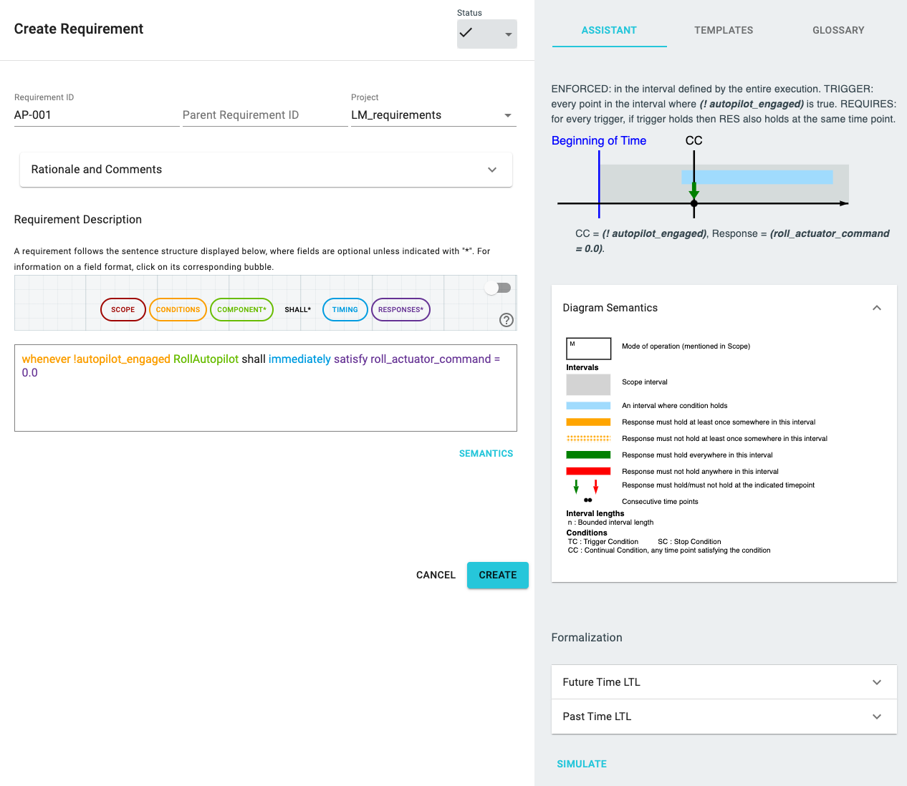

# Unambiguous Requirements with FRET

***

***

FRET allows you to write requirements in _free_ natural language by entering the sentence within quotes. However, if you use FRETish, you get the added benefit of having clear unambiguous semantics, that can then be exported in a variety of forms for sophisticated tools to analyze.

FRETish semantics is defined in Real-Time Graphic Interval Logic (RTGIL): [FRETishSemantics.pdf](./fretishSemantics.pdf)

FRET helps users understand semantics for the requirements they write. You can access the semantics of a requirement that is being created by selecting the _Semantics_ button, as shown in the screenshot above. This allows you to access the following descriptions:

1. Natural language. Provides an English language description of what your requirement means.
2. Diagrammatic. Provides a diagram illustrating what your requirement means, together with the diagram legend.

Moreover, the following formalizations can be displayed, even though more options are available by FRET, such as CoCoSpec, and infinite-trace future-time metric temporal logic.

1. Future Time Metric Linear Temporal Logic for finite traces, in format compatible with the [SMV](https://en.wikipedia.org/wiki/NuSMV) model checker.
2. Past Time Metric Linear Temporal Logic, in format compatible with the [SMV](https://en.wikipedia.org/wiki/NuSMV) model checker.

FRET generates semantics based on templates. Each template is represented by a quadruple [scope, condition,timing,response], representing different options for the corresponding fields of each written requirement.

Let us look at our example requirement: In flight mode the battery shall always satisfy voltage > 9 

It corresponds to the template [in, null, always, satisfaction], and its semantics and formalizations can be seen in the screenshot above.

[Back to FRET home page](../userManual.md)   
