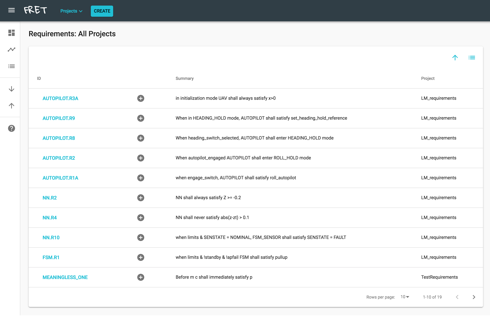

# Sortable Table Display

In this mode, FRET displays your requirements in a flat, tabular form, as seen below.

***

***

You can sort your requirements based on any field represented in the table columns,
i.e., Status, ID, summary, or project (if in _All Projects_ view).

You can track your work progress for each requirement using its status.  Using the drop down menu under the Status column, you can set the status of each requirement to one of six values: "default", "in progress", "paused", "completed", "attention" and "deprecated".  Red background of drop down menu indicates requirements that cannot be formalized, as opposed to green. 

On the right of each requirement id, the plus sign button allows you to create a child requirement. Child requirement forms opened in this fashion have their _parent requirement_ id field automatically filled out.

The top right _list_ button allows you to enter a mode where you can select individual requirements in the table for exporting or other functions.

[Back to FRET home page](../../../userManual.md)
