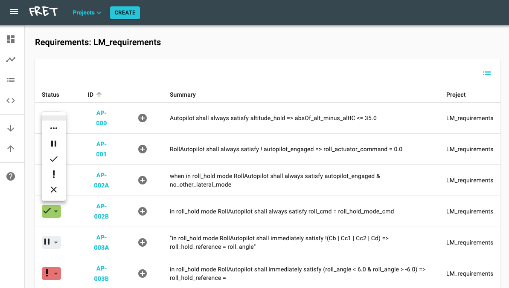
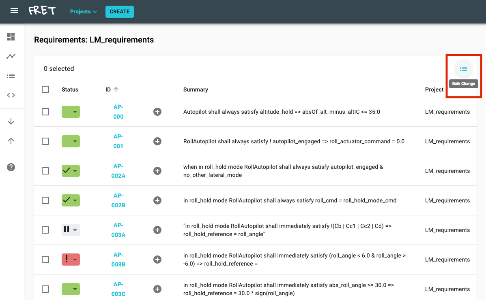
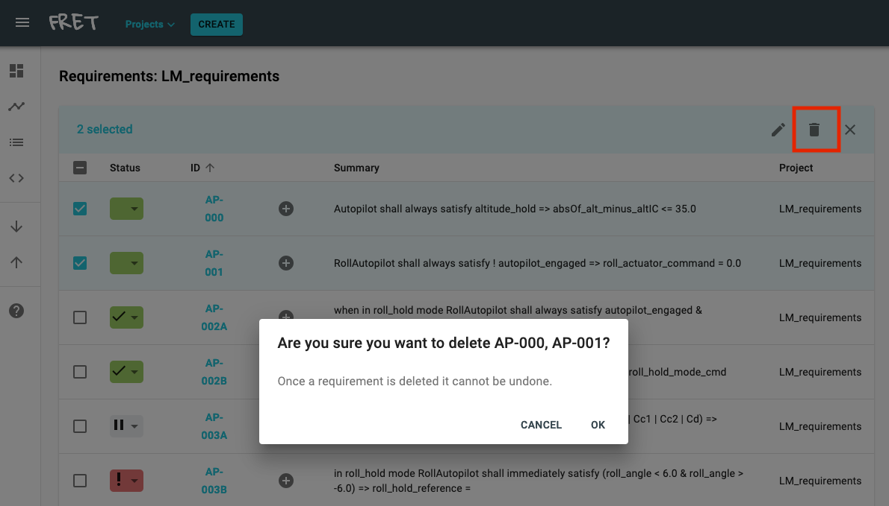

# Sortable Table Display

In this mode, FRET displays your requirements in a flat, tabular form, as seen below.

***

***

You can sort your requirements based on any field represented in the table columns,
i.e., Status, ID, summary, or project (if in _All Projects_ view).

You can track your work progress for each requirement using its status.  Using the drop down menu under the Status column, you can set the status of each requirement to one of six values: "default", "in progress", "paused", "completed", "attention" and "deprecated".  Red background of drop down menu indicates requirements that cannot be formalized due to parsing errors or "meaningless" field combinations. Green background indicates formalized requirements. White background indicates requirements for which the FRETish version is empty or has been entered within quotes.

***

***

On the right of each requirement ID, the plus sign button allows you to create a child requirement. Child requirement forms opened in this fashion have their _parent requirement_ id field automatically filled out.

The top right _list_ button allows you to enter a mode where you can select individual requirements in the table for bulk deleting them.

***

***

Once the Bulk Change button is selected, you can select multiple requirements to delete as shown below.

***

***

By clicking on the _Delete_ button a widget pops up that asks you whether to proceed with the deletion of the selected requirements.

***

***

[Back to FRET home page](../../userManual.md)
