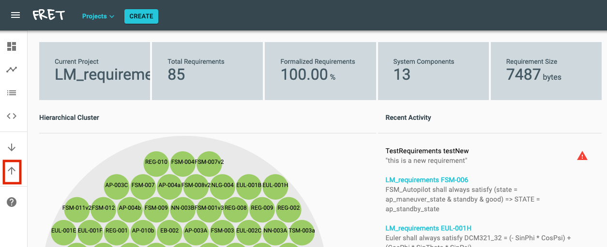
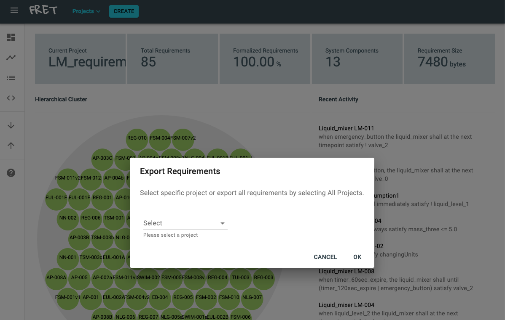
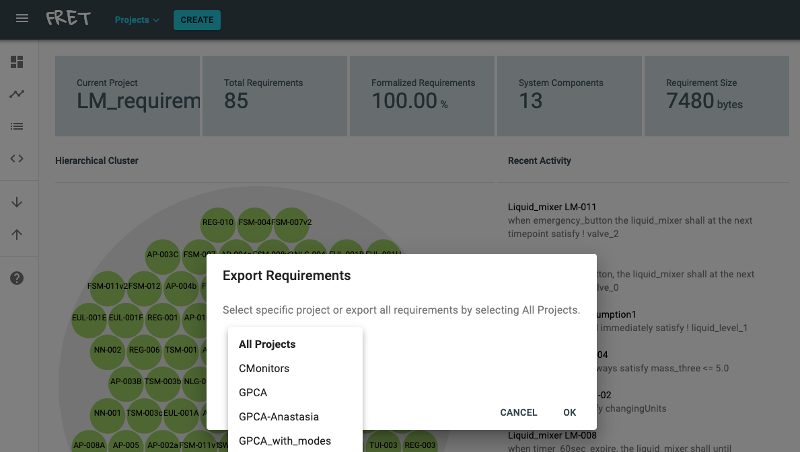
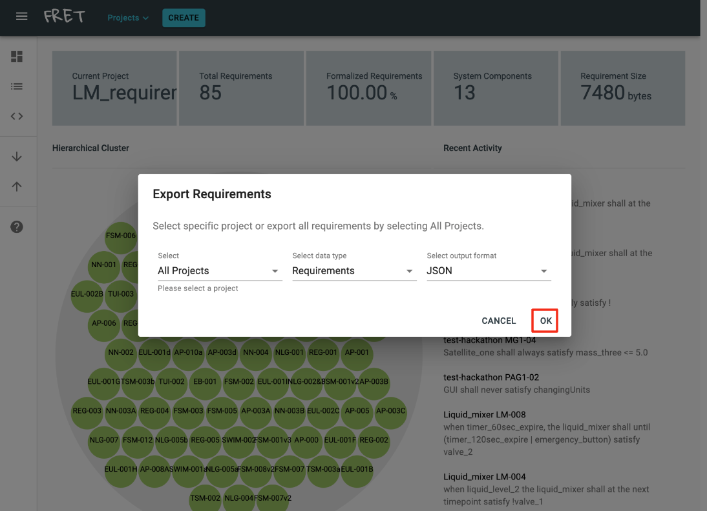
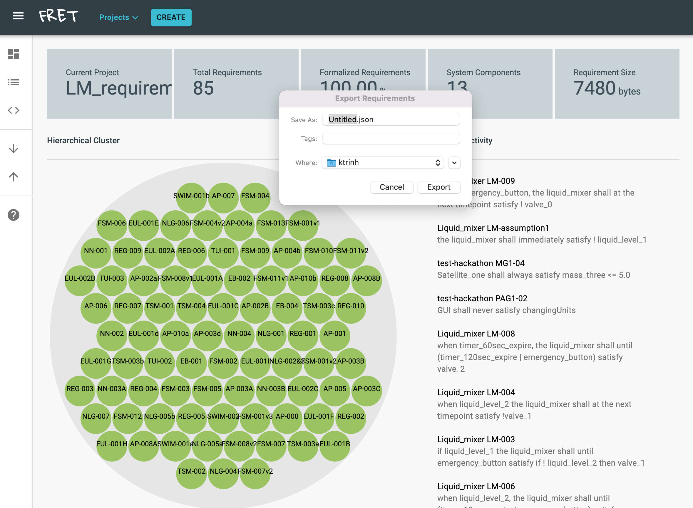

# How to export requirements from FRET

FRET exports requirements in JSON format. FRET users can export and share their requirements.

To export requirements from your FRET installation, click the **upward arrow** button.
***

***

Then, the  **Export Requirements** dialog will pop up through which you can choose a specific project to export or choose to export *All Projects*.
***

***

Once you have selected a specific project to export or *All Projects*, click on the **OK** button.
***

***

Then the **Export Requirements** dialog will pop up, Through which you can specify the name of the json file and choose where to save it. Once ready click the **Export** button. Your requirements will be saved in your preferred location.
***

***

[Back to the tutorial page](../tutorial.md)

[Back to FRET home page](../../userManual.md)
