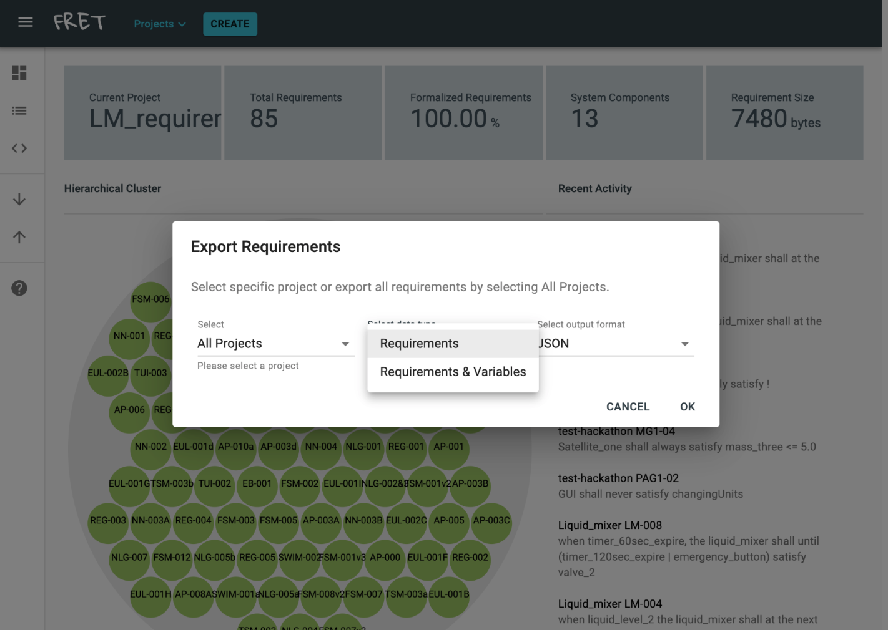
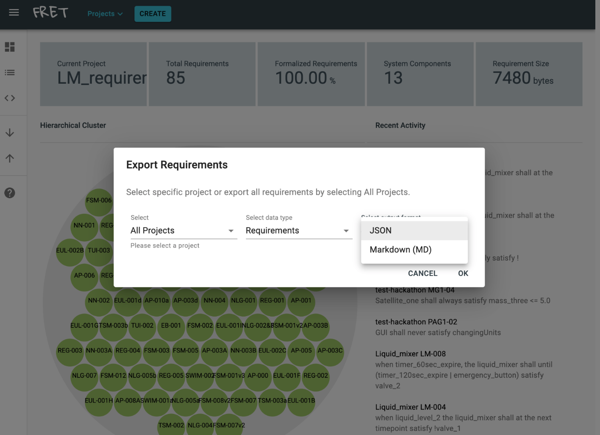

# How to export requirements and variables from FRET

FRET users can export and share their requirements and variables.  FRET exports requirements in JSON or Markdown format. Fret exports variables in JSON format.

To export requirements or to export requirements and variables from your FRET installation, click the **upward arrow** button.
***

***

Then, the  **Export Requirements** dialog will pop up through which you can choose a specific project to export or choose to export *All Projects*.
***

***

You can choose to export only *requirements* or both *requirements & variables* from the *Select data type* dropdown menu.  For exporting only requirements, you can choose the *JSON* or *Markdown (MD)* output format from the *Select output format* dropdown menu.

***

Once you have selected a specific project to export or *All Projects*, the data type and the output format, click on the **OK** button.
***

***

Then the **Export Requirements** dialog will pop up, Through which you can specify the name of the json or md file and choose where to save it. Once ready click the **Export** button. Your requirements and variables if selected will be saved in your preferred location.
***

***

[Back to the tutorial page](../tutorial.md)

[Back to FRET home page](../../userManual.md)
