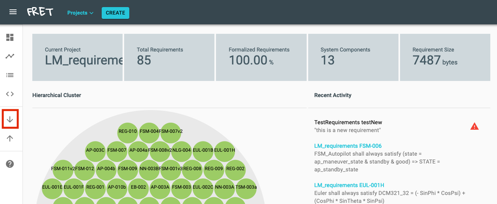
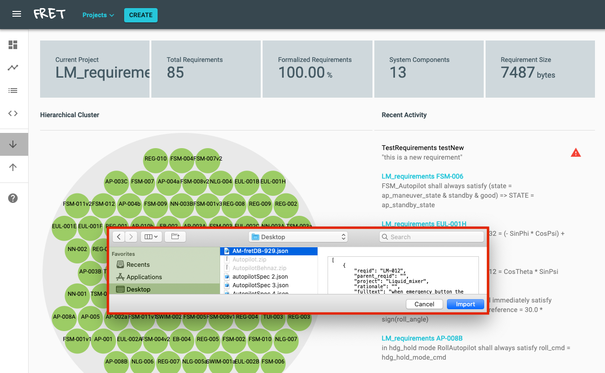
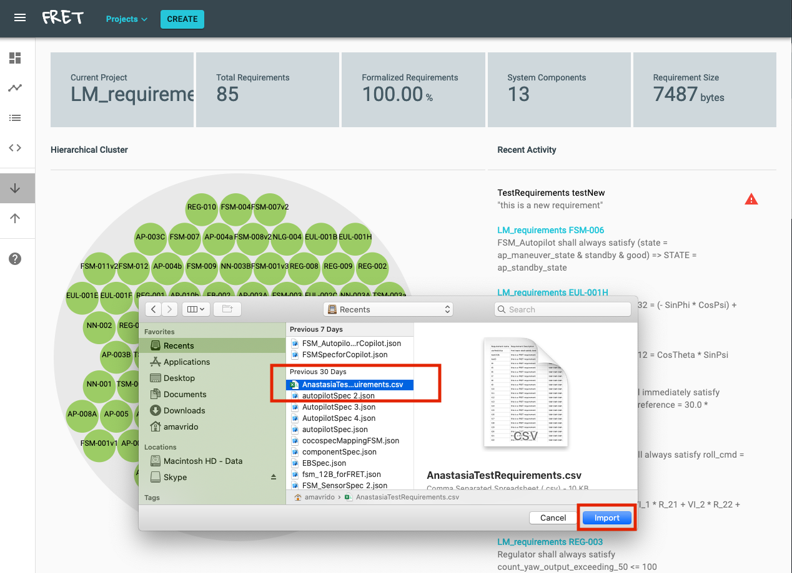
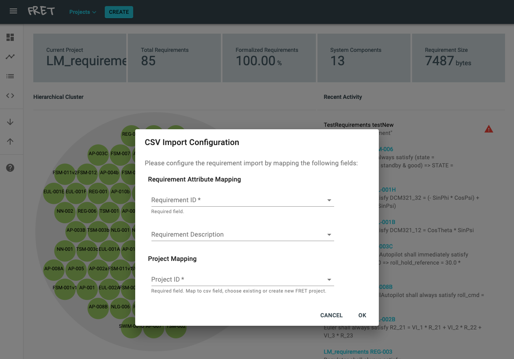
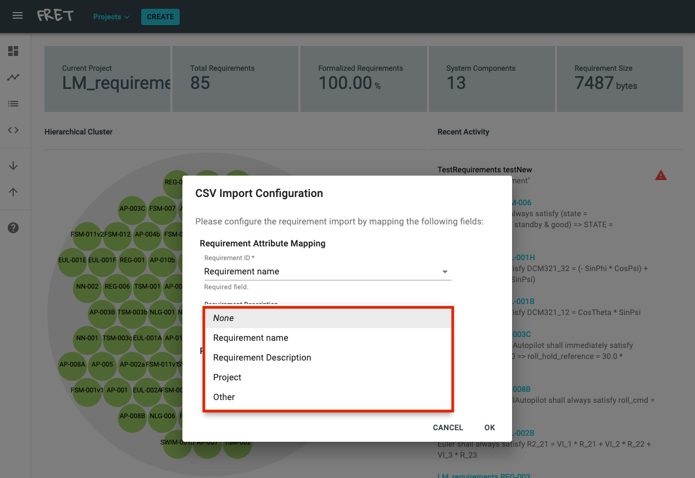
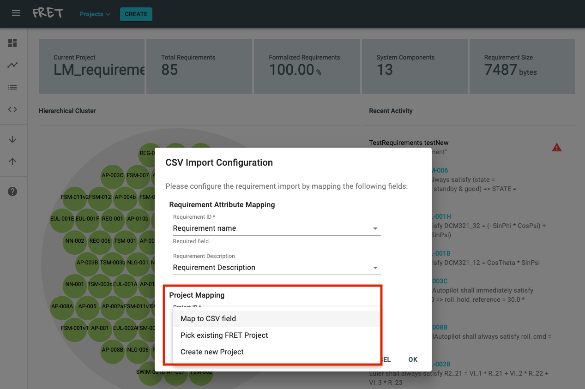
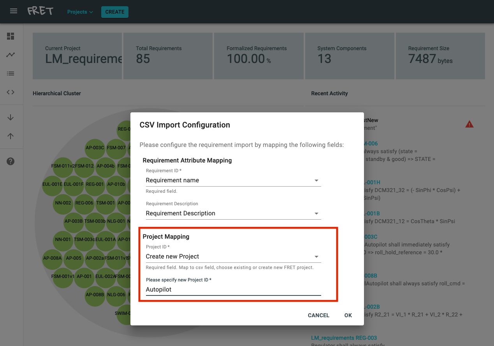

# How to import a FRET project

FRET allows users to import projects in two different formats: 1) CSV and 2) JSON. A JSON file must adhere to the format that FRET exports to (read [here](./export.md) about how to export a FRET project).

To import a FRET project, click the **downward arrow** button.
***

***
Once you click on the arrow button, a dialog will pop up that will allow you to pick the JSON or CSV file to import. FRET automatically filters out all other file formats and allows you to import only CSV and JSON files.

## How to import JSON
If you want to import a JSON file, you only need to pick the file and click on the **Import** button.
***

***
## How to import CSV
If you want to import a CSV file then please pick the file to import and click **Import**.
***

***
Then FRET will ask you through the **CSV Import Configuration** dialog to configure the requirement import.
***

***
FRET will automatically your CSV file and extract information about the fields of the file. The configuration part involves indicating 1) the field in the CSV file that corresponds to the requirement IDs and 2) the field in the CSV file that corresponds to the requirement description, i.e., usually the natural language description of a requirement. This can be done by picking the correct field from the drop down menu.
***

***
Additionally, FRET will ask you specify the name of the project of the imported requirements. The name of the project can be specified through the following three options: 1) it can correspond to a field in the CSV file, 2) it can be an existing FRET project, and 3) it can be a new FRET project.
***

***
In the last case, FRET will prompt you to specify a new project name.
***

***
When you have added all the necessary information, click on the **OK** button to finish the requirement import.

[Back to the tutorial page](../tutorial.md)

[Back to FRET home page](../../userManual.md)
