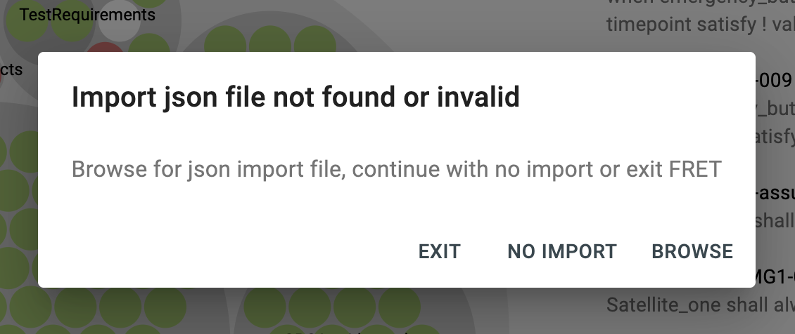
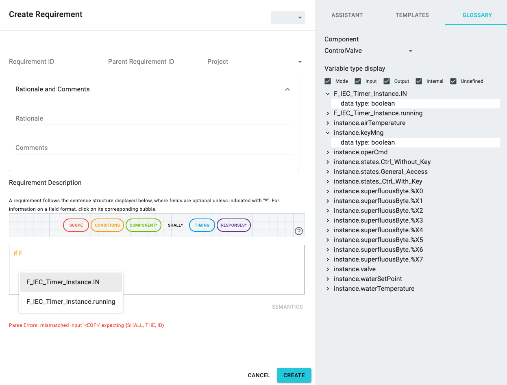

# Connecting with external tools

Upon starting the `ext` mode, the FRET requirement editor pops up. A user may then write a requirement, check the requirement semantics by utilizing the produced explanations and the simulator, and finally export the generated formalizations in the form of a JSON file. This new mode also allows users to import a variable glossary, in the form a JSON file, into the requirement editor. The variable glossary enables the autocomplete feature of the requirement editor.

## How to use the ext mode

To use the `ext` mode, run FRET with the following command: `npm run ext`

Environment variables can be used to set the absolute paths of 1) the glossary variable file to import  and 2) the formalizations file to export from FRET. Use the `EXTERNAL_IMP_JSON` environment variable for the former and the `EXTERNAL_EXP_JSON` variable for the latter.

Here is an example:

 `EXTERNAL_IMP_JSON=<Path_to_import_file> EXTERNAL_EXP_JSON=<Path_to_export_file> npm run ext`

Do not include the ".json" file extension as part of the paths.

 ## Variable Glossary

 Upon starting FRET in the `ext` mode,  FRET loads the  input JSON file defined by the `EXTERNAL_IMP_JSON` environment variable.  If the environment variable is undefined or the file defined is not valid, FRET will pop up a dialog that allows users to browse for an input file, continue with no import or exit.

***


***

The format of the variable glossary JSON file is an object of an array variable `docs`. Here is an example of a glossary with two variables:

```
"variables": {
    "docs": [
      {
        "component_name": "ControlValve",
        "dataType": "boolean",
        "project": "",
        "tool": "PLCverif",
        "variable_name": "instance.keyMng",
        "width": 1,
        "modeldoc": false,
        "idType": ""
      },
      {
        "component_name": "ControlValve",
        "dataType": "integer",
        "project": "",
        "tool": "PLCverif",
        "variable_name": "instance.operCmd",
        "width": 32,
        "modeldoc": false,
        "idType": ""
      }
    ]
  }
```

The following screenshot displays how an imported variable glossary looks in the requirement editor and the autocomplete feature.
***


***

## Exporting requirements and their formalizations

 After writing a FRETish requirement, users can save the resulting formalizations in JSON file by clicking the "update" button.  If the EXTERNAL_EXP_JSON environment variable is defined and the location of the resulting file is valid, FRET will write results to this file.  If the environment variable is undefined or invalid, FRET will write results to a default file named requirement.json in the user Documents directory.  If an output file with the same name exists, FRET will overwrite it.  FRET automatically exits after exporting the output file.


[Back to the tutorial page](../tutorial.md)

[Back to FRET home page](../../userManual.md)
