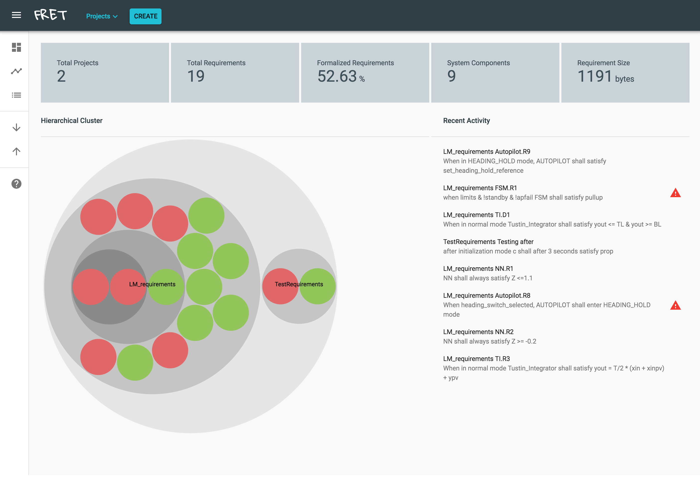

# Quick Tutorial

FRET's dashboard summarizes the status of your projects and provides a hierarchical view of all the requirements, as shown below. Prior to creating any projects, the dashboard will not have anything to display and will be blank.  

***

***

## Getting started

To get started, select the **Projects** menu pull down to select an existing project, or to create a new project, where your requirements belong.

## Dashboard displays
The dashboard displays all your projects and their corresponding requirements in a hierarchical fashion. The red bubbles indicate requirements that aren't expressed in correct FRETish and therefore aren't formalized. Green bubbles have been correctly parsed in FRETish and formalized. White bubbles indicate requirements that are empty or that have been entered within quotes, indicating that parsing in FRETish has not been attempted. You can navigate within the bubble hierarchy, and view requirements summaries by hovering over a requirement bubble. Several statistics are displayed on the top of the dashboard.

Recent activity is displayed on the right hand side of the dashboard, where a warning icon exists next to requirements that are not formalized.

As soon as you select a specific project, the dashboard filters the information to your selected project. Moreover, it highlights, in the list of recently edited requirements, those requirements that belong to the selected project.

## Writing requirements

Select the **Create** button to create a new requirement. Fill in a unique requirement identifier, such as *ProjectName-ComponentName-Number*. You will be warned if that requirement ID is already in use. You can optionally specify the requirement ID of a parent requirement, and also a rationale for the requirement. Details on how to write requirements are available [here](./writingReqs.md).

## Sortable table display

To view and edit the requirements in your project in a tabular form, select the _list_ button on the left of the dashboard. More information on this view is available [here](./examples/table.md)

## Exporting/Importing requirements

Export and import buttons are available for saving/exporting your requirements or importing requirements written by other users in FRET.

More information on how to export is available [here](./exportImport/export.md).
More information on how to import is available [here](./exportImport/import.md).

## Connecting with external tools

FRET provides the `ext`  execution mode to facilitate connection and integration into external tools. The mode, which has been implemented as a node script,  allows users to run the requirement editor, the formalization component, and the requirements simulator as a standalone tool.

More information on the `ext` mode is available [here](./external/ext_tools.md).

## FRET databases

FRET uses a database for tracking requirements and another database for tracking model information for analysis tools.  Users can point FRET to which database locations to use.  More info on setting database locations is available [here](./dbPaths.md)

[Back to FRET home page](../userManual.md)
