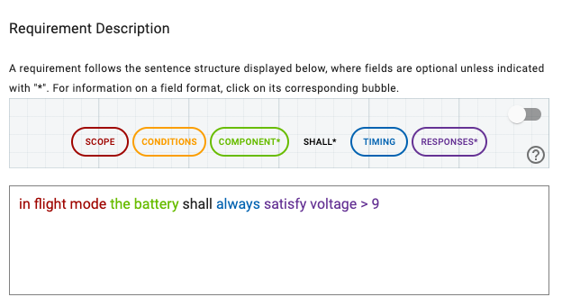
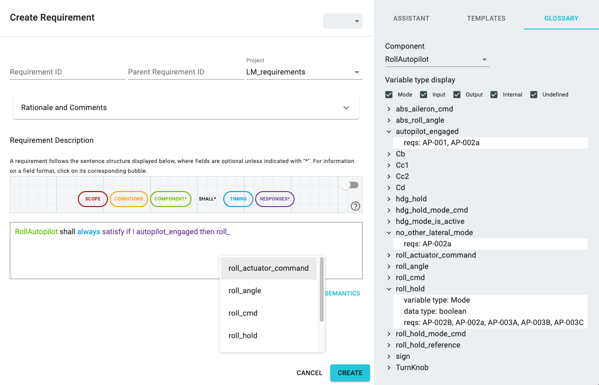

# Writing Requirements in FRET

***

***

A FRET requirement is an English (to be precise "FRETish") sentence containing up to six fields: *scope*, *condition*, *component*, *shall*, *timing* and *response*. Three fields are mandatory: component, shall, response. There is a [grammar](../fretishGrammar/index.html ':include width=100% height=800px') for the allowable sentences. The grammar, displayed as "railroad diagrams", is accessible from this view by clicking on the question mark. Mind you, this is not for the faint-hearted.

Here is an example requirement:
**"In flight mode the battery shall always satisfy voltage > 9"** 

While typing the body of a requirement, FRET parses the requirement and recognizes and color codes the parts associated with each field. The lower part of the window dynamically displays (in red) parser feedback while typing. Help is provided for the user by clicking on the corresponding colored field bubbles on top of the editor.

## Mandatory fields

1. Component. Specifies the *component* that the requirement refers to. [Component Help Menu](./examples/component.md)

2. Shall. The word *shall* expresses that the component's behavior must conform to the requirement. This is typical in requirements documents.

3. Response. Specifies the *response*, which is the required component behavior. It must be a boolean condition that the component's behavior must satisfy. [Response Help Menu](./examples/response.md)

## Optional fields

1. Scope. The optional *scope* field specifies the period where the requirement holds. If omitted, the requirement is deemed to hold universally, subject to condition, below. The scope is specified relative to system *modes*. The scope can specify system behavior *before* a specified mode occurs, or *after* a specified mode ends, or when the system is *in* a specified mode. The mode is specified by giving its mode name. [Scope Help Menu](./examples/scope.md)

2. Condition. The optional *condition* field is a boolean expression that further constrains when the requirement response is to occur.  The boolean expression is in terms of variables. [Condition Help Menu](./examples/condition.md)

3. Timing. The optional *timing* field specifies when the response shall happen, relative to the scope and condition.  Timing can be *immediately*, *eventually*, *always*, *never*, *within N time units*,  *for N time units*, or *after N time units*. The latter means that the response happens _N_ time units from the beginning of the requirement's period, and does not happen before that; i.e., does not happen for *N-1* time units after the beginning of the period. [Timing Help Menu](./examples/timing.md)

> __Note:__ The Boolean operators allowed in the Boolean expression condition and response fields are: `!` (negation), `&` (conjunction), `|` (disjunction), `xor` (exclusive or),  `->` (implication), `<->` (equivalence). An alternative for implication is `if p then q`. The numeric comparison operators are `=, !=, <, >, <=, >=`. The numeric operators are `+, -, *, /, mod`, and `^` (exponentiation). Numerical terms and predicates are in standard form; e.g., `f(x,y)`,  `p(x,y,z)`.

### Templates tab

Predefined templates simplify requirement writing to just filling necessary fields. You can access the *TEMPLATES* tab from the right pane on the *Create Requirement* or *Update Requirement* dialog.  A number of templates are already available in FRET: *Change State*, *Process Command*, *Check Bounds*, *Set Diagnostic Flag*, and *Prescribe Format*. More templates can be added on demand by the users as explained in [createTemplate](../creatingTemplates/createTemplate.md).

Upon selecting a predefined template, a FRETish requirement appears in the editor with fields that need to be completed. For example, in the screenshot shown below, the *component*, *input_state*, *condition*, and *output_state* fields must be completed so that the requirement parses successfully.  An explanation of the chosen template and examples of how to instantiate the required fields are shown in the *TEMPLATES* pane.  

***

***

### Variable glossary tab

FRET provides help to the user when writing requirements. For example, if a user wants to reuse a set of variables amongst the requirements of a specific project and has already entered some requirements, then FRET lists the variable names that were already used for these requirements in the *GLOSSARY* tab.

You can access the *GLOSSARY* tab from the right pane in the *Create Requirement* or *Update Requirement* dialog.  After selecting a project, you can select a component in the selected project using the *Component* menu bar. FRET then displays existing variables of the selected component. These variables can be filtered by the variable type including *Mode*, *Inputs*, *Outputs* and *Internal* using check boxes under the *Component* menu bar.  *Undefined* is used for variables with no existing assigned type. The variable types can  be assigned through the [FRET analysis portal](../ExportingForAnalysis/analysis.md).

***

***

You can expand a variable on the *GLOSSARY* tab to see more details.  The details include a list of requirements referencing this variable and show values of varialbe attributes that are defined.  Current attributes of a variable include *variable type*, *data type*, *assignment*, *modelComponent*, and *description*.

***

***

The list of variables shown in the *GLOSSARY* tab is used to autocomplete when typing in the editor of the  *Create Requirement* and *Update Requirement* dialog.

***

***

[Back to FRET home page](../userManual.md)
